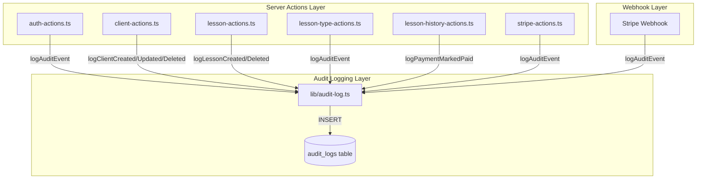

# Design Document: Audit Logging Integration

## Overview

This design connects the existing audit logging infrastructure ([lib/audit-log.ts](../../../lib/audit-log.ts)) to all server actions across the application. The database schema (`audit_logs` table) and helper functions are already implemented - this work adds the integration points to capture security-critical events.

## Architecture

### System Boundaries



### Integration Pattern

All audit logging calls follow a **fire-and-forget** pattern where:
1. The main operation completes first
2. Audit logging is called after success
3. Audit logging failures do NOT block or fail the main operation
4. Failures are logged to console for monitoring

```typescript
// Pattern: Call audit log AFTER successful operation
const { data, error } = await supabase.from('clients').insert({...});

if (error) {
  return { success: false, error: error.message };
}

// Fire-and-forget audit log (don't await in critical path)
logClientCreated(user.id, data.id, `${data.first_name} ${data.last_name}`, {
  email: data.parent_email,
  phone: data.parent_phone,
});

return { success: true, data };
```

## Components and Interfaces

### 1. Extended AuditActions Constants

Add missing action types to [lib/audit-log.ts](../../../lib/audit-log.ts):

```typescript
export const AuditActions = {
  // Existing actions...

  // New auth actions
  AUTH_LOGIN_FAILED: 'auth.login_failed',
  AUTH_PASSWORD_RESET_REQUESTED: 'auth.password_reset_requested',
  AUTH_PASSWORD_UPDATED: 'auth.password_updated',

  // New subscription actions
  SUBSCRIPTION_CHECKOUT_CREATED: 'subscription.checkout_created',
  SUBSCRIPTION_CREATED: 'subscription.created',
  SUBSCRIPTION_UPDATED: 'subscription.updated',
  SUBSCRIPTION_CANCELLED: 'subscription.cancelled',
  SUBSCRIPTION_PAYMENT_FAILED: 'subscription.payment_failed',

  // New lesson actions
  LESSON_COMPLETED: 'lesson.completed',
  LESSON_UPDATED: 'lesson.updated',
  LESSON_NO_SHOW: 'lesson.no_show',
} as const;
```

### 2. New Helper Functions

Add these convenience functions to [lib/audit-log.ts](../../../lib/audit-log.ts):

```typescript
// Auth helpers
export async function logLoginSuccess(userId: string, email: string) {
  return logAuditEvent({
    userId,
    userEmail: email,
    action: AuditActions.USER_LOGGED_IN,
    resourceType: ResourceTypes.USER,
    resourceId: userId,
    description: `User logged in: ${email}`,
  });
}

export async function logLoginFailed(email: string, reason?: string) {
  // Use a placeholder userId for failed logins (email hash or static)
  return logAuditEvent({
    userId: '00000000-0000-0000-0000-000000000000', // System user for failed attempts
    userEmail: email,
    action: AuditActions.AUTH_LOGIN_FAILED,
    resourceType: ResourceTypes.USER,
    description: `Login failed for: ${email}`,
    metadata: reason ? { reason } : undefined,
  });
}

export async function logLogout(userId: string, email?: string) {
  return logAuditEvent({
    userId,
    userEmail: email,
    action: AuditActions.USER_LOGGED_OUT,
    resourceType: ResourceTypes.USER,
    resourceId: userId,
    description: `User logged out`,
  });
}

export async function logPasswordResetRequested(email: string) {
  return logAuditEvent({
    userId: '00000000-0000-0000-0000-000000000000',
    userEmail: email,
    action: AuditActions.AUTH_PASSWORD_RESET_REQUESTED,
    resourceType: ResourceTypes.USER,
    description: `Password reset requested for: ${email}`,
  });
}

export async function logPasswordUpdated(userId: string, email?: string) {
  return logAuditEvent({
    userId,
    userEmail: email,
    action: AuditActions.AUTH_PASSWORD_UPDATED,
    resourceType: ResourceTypes.USER,
    resourceId: userId,
    description: `Password updated`,
  });
}

export async function logSignup(userId: string, email: string) {
  return logAuditEvent({
    userId,
    userEmail: email,
    action: AuditActions.USER_SIGNUP,
    resourceType: ResourceTypes.USER,
    resourceId: userId,
    description: `New user signed up: ${email}`,
  });
}

// Lesson type helpers
export async function logLessonTypeCreated(
  userId: string,
  lessonTypeId: string,
  name: string,
  hourlyRate: number
) {
  return logAuditEvent({
    userId,
    action: AuditActions.LESSON_TYPE_CREATED,
    resourceType: ResourceTypes.LESSON_TYPE,
    resourceId: lessonTypeId,
    description: `Created lesson type: ${name}`,
    metadata: { name, hourly_rate: hourlyRate },
  });
}

export async function logLessonTypeUpdated(
  userId: string,
  lessonTypeId: string,
  name: string,
  changes: Record<string, any>
) {
  return logAuditEvent({
    userId,
    action: AuditActions.LESSON_TYPE_UPDATED,
    resourceType: ResourceTypes.LESSON_TYPE,
    resourceId: lessonTypeId,
    description: `Updated lesson type: ${name}`,
    metadata: { changes },
  });
}

export async function logLessonTypeDeleted(
  userId: string,
  lessonTypeId: string,
  name: string
) {
  return logAuditEvent({
    userId,
    action: AuditActions.LESSON_TYPE_DELETED,
    resourceType: ResourceTypes.LESSON_TYPE,
    resourceId: lessonTypeId,
    description: `Deleted lesson type: ${name}`,
  });
}

// Lesson helpers
export async function logLessonUpdated(
  userId: string,
  lessonId: string,
  title: string,
  changes: Record<string, any>
) {
  return logAuditEvent({
    userId,
    action: AuditActions.LESSON_UPDATED,
    resourceType: ResourceTypes.LESSON,
    resourceId: lessonId,
    description: `Updated lesson: ${title}`,
    metadata: { changes },
  });
}

export async function logLessonCancelled(
  userId: string,
  lessonId: string,
  title: string,
  reason?: string
) {
  return logAuditEvent({
    userId,
    action: AuditActions.LESSON_CANCELLED,
    resourceType: ResourceTypes.LESSON,
    resourceId: lessonId,
    description: `Cancelled lesson: ${title}`,
    metadata: reason ? { reason } : undefined,
  });
}

export async function logLessonCompleted(
  userId: string,
  lessonId: string,
  title: string
) {
  return logAuditEvent({
    userId,
    action: AuditActions.LESSON_COMPLETED,
    resourceType: ResourceTypes.LESSON,
    resourceId: lessonId,
    description: `Completed lesson: ${title}`,
  });
}

export async function logLessonNoShow(
  userId: string,
  lessonId: string,
  title: string
) {
  return logAuditEvent({
    userId,
    action: AuditActions.LESSON_NO_SHOW,
    resourceType: ResourceTypes.LESSON,
    resourceId: lessonId,
    description: `Marked lesson as no-show: ${title}`,
  });
}

// Subscription helpers
export async function logSubscriptionCheckoutCreated(
  userId: string,
  priceId: string
) {
  return logAuditEvent({
    userId,
    action: AuditActions.SUBSCRIPTION_CHECKOUT_CREATED,
    resourceType: ResourceTypes.PROFILE,
    resourceId: userId,
    description: `Checkout session created`,
    metadata: { price_id: priceId },
  });
}

export async function logSubscriptionCreated(
  userId: string,
  subscriptionId: string,
  customerId: string
) {
  return logAuditEvent({
    userId,
    action: AuditActions.SUBSCRIPTION_CREATED,
    resourceType: ResourceTypes.PROFILE,
    resourceId: userId,
    description: `Subscription activated`,
    metadata: { subscription_id: subscriptionId, customer_id: customerId },
  });
}

export async function logSubscriptionUpdated(
  userId: string,
  subscriptionId: string,
  newStatus: string
) {
  return logAuditEvent({
    userId,
    action: AuditActions.SUBSCRIPTION_UPDATED,
    resourceType: ResourceTypes.PROFILE,
    resourceId: userId,
    description: `Subscription updated to ${newStatus}`,
    metadata: { subscription_id: subscriptionId, new_status: newStatus },
  });
}

export async function logSubscriptionCancelled(
  userId: string,
  subscriptionId: string
) {
  return logAuditEvent({
    userId,
    action: AuditActions.SUBSCRIPTION_CANCELLED,
    resourceType: ResourceTypes.PROFILE,
    resourceId: userId,
    description: `Subscription cancelled`,
    metadata: { subscription_id: subscriptionId },
  });
}

export async function logSubscriptionPaymentFailed(
  userId: string,
  invoiceId: string
) {
  return logAuditEvent({
    userId,
    action: AuditActions.SUBSCRIPTION_PAYMENT_FAILED,
    resourceType: ResourceTypes.PROFILE,
    resourceId: userId,
    description: `Subscription payment failed`,
    metadata: { invoice_id: invoiceId },
  });
}
```

## Data Models

### Existing audit_logs Table Schema

The table already exists with proper schema:

| Column | Type | Description |
|--------|------|-------------|
| id | UUID | Primary key |
| user_id | UUID | FK to auth.users |
| user_email | TEXT | Email for reference |
| action | TEXT | Format: `resource.action` |
| resource_type | TEXT | Type of resource affected |
| resource_id | UUID | ID of affected resource |
| description | TEXT | Human-readable description |
| metadata | JSONB | Additional structured data |
| ip_address | INET | Client IP (optional) |
| user_agent | TEXT | Browser info (optional) |
| created_at | TIMESTAMPTZ | When event occurred |

## Integration Points

### 1. auth-actions.ts Integration

| Function | Audit Event | When to Log |
|----------|-------------|-------------|
| `loginAction` | `auth.logged_in` | After successful login |
| `loginAction` | `auth.login_failed` | After failed login |
| `signupAction` | `auth.signup` | After successful signup |
| `logoutAction` | `auth.logged_out` | After successful logout |
| `requestPasswordResetAction` | `auth.password_reset_requested` | After request sent |
| `updatePasswordAction` | `auth.password_updated` | After successful update |

### 2. client-actions.ts Integration

| Function | Audit Event | When to Log |
|----------|-------------|-------------|
| `addClient` | `client.created` | After successful insert |
| `updateClient` | `client.updated` | After successful update |
| `deleteClient` | `client.deleted` | After successful delete |

### 3. lesson-actions.ts Integration

| Function | Audit Event | When to Log |
|----------|-------------|-------------|
| `createLesson` | `lesson.created` | After successful insert |
| `createLessonWithParticipants` | `lesson.created` | After successful insert |
| `createLessonWithParticipants` (recurring) | `recurring_lessons.created` | After successful batch insert |
| `updateLesson` | `lesson.updated` | After successful update |
| `cancelLesson` | `lesson.cancelled` | After successful cancellation |
| `completeLesson` | `lesson.completed` | After successful completion |
| `deleteLesson` | `lesson.deleted` | After successful delete |

### 4. lesson-type-actions.ts Integration

| Function | Audit Event | When to Log |
|----------|-------------|-------------|
| `createLessonType` | `lesson_type.created` | After successful insert |
| `updateLessonType` | `lesson_type.updated` | After successful update |
| `deleteLessonType` | `lesson_type.deleted` | After successful soft-delete |

### 5. lesson-history-actions.ts Integration

| Function | Audit Event | When to Log |
|----------|-------------|-------------|
| `confirmLesson` | `lesson.completed` | After successful confirmation |
| `markLessonNoShow` | `lesson.no_show` | After successful no-show mark |
| `markLessonAsPaid` | `payment.marked_paid` | After successful payment mark |
| `markAllLessonsPaid` | `payments.bulk_marked_paid` | After successful bulk payment |

### 6. stripe-actions.ts Integration

| Function | Audit Event | When to Log |
|----------|-------------|-------------|
| `createCheckoutSession` | `subscription.checkout_created` | After session created |

### 7. Stripe Webhook Integration

| Handler | Audit Event | When to Log |
|---------|-------------|-------------|
| `handleCheckoutSessionCompleted` | `subscription.created` | After profile updated |
| `handleSubscriptionUpdated` | `subscription.updated` | After status change |
| `handleSubscriptionDeleted` | `subscription.cancelled` | After cancellation |
| `handleInvoicePaymentFailed` | `subscription.payment_failed` | After payment failure |

## Error Handling

### Non-Blocking Pattern

```typescript
// CORRECT: Don't await, let it run in background
logClientCreated(user.id, data.id, clientName);

// CORRECT: If you need to await, wrap in try-catch that doesn't re-throw
try {
  await logClientCreated(user.id, data.id, clientName);
} catch (auditError) {
  console.error('Audit log failed:', auditError);
  // DO NOT re-throw - main operation already succeeded
}

// INCORRECT: This would block on audit failure
const auditResult = await logClientCreated(...);
if (!auditResult) {
  return { success: false, error: 'Audit log failed' }; // WRONG!
}
```

### Failed Login Handling

For failed logins, we need to log the attempt even without a valid user ID:
- Use a system placeholder UUID: `00000000-0000-0000-0000-000000000000`
- This bypasses RLS since there's no authenticated user
- The audit log will still capture the attempted email

## Testing Strategy

### Unit Tests

1. Test that audit functions are called after successful operations
2. Test that main operations succeed even when audit logging fails
3. Test correct metadata is passed to audit functions

### Integration Tests

1. Verify audit_logs table receives entries after operations
2. Test RLS policies allow authenticated users to read their own logs
3. Test failed login attempts are logged with system user

### Manual Testing Checklist

- [ ] Login success creates audit log
- [ ] Login failure creates audit log with system user
- [ ] Signup creates audit log
- [ ] Logout creates audit log
- [ ] Password reset request creates audit log
- [ ] Password update creates audit log
- [ ] Client CRUD operations create audit logs
- [ ] Lesson CRUD operations create audit logs
- [ ] Lesson type CRUD operations create audit logs
- [ ] Payment operations create audit logs
- [ ] Stripe webhook events create audit logs

## Implementation Order

1. **Phase 1: Extend audit-log.ts** - Add new action constants and helper functions
2. **Phase 2: Auth actions** - Most security-critical, implement first
3. **Phase 3: Client actions** - Simple CRUD, good test case
4. **Phase 4: Lesson actions** - More complex with recurring lessons
5. **Phase 5: Lesson type actions** - Simple CRUD
6. **Phase 6: Lesson history actions** - Payment tracking
7. **Phase 7: Stripe integration** - Webhook and checkout actions

## Security Considerations

1. **Never log passwords** - Only log email for failed attempts
2. **No PII in descriptions** - Keep descriptions generic, put details in metadata
3. **Rate limit sensitive logs** - Login failures are already rate-limited
4. **RLS protection** - Audit logs table has RLS policies restricting access
5. **Immutable logs** - No UPDATE/DELETE policies on audit_logs table
