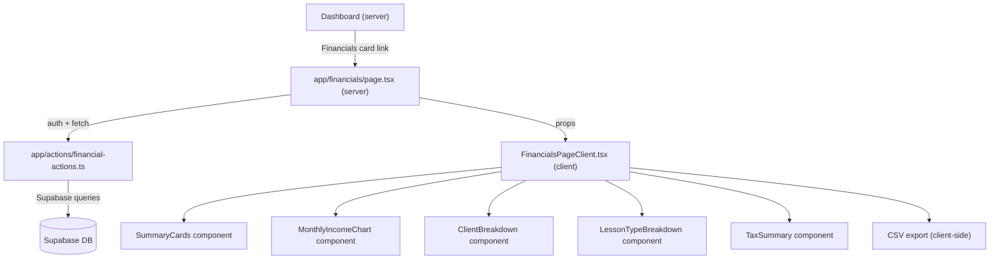

# Design Document: Coach Financials

## Overview

The Coach Financials feature adds a `/financials` route with income summaries, charts, breakdowns, and tax reporting. It follows the existing app architecture: a **server component** page that authenticates and fetches data via server actions, passing it to a **client component** for interactive rendering.

No new database tables or migrations are needed for Phase 1. All data is derived from existing `lessons`, `lesson_participants`, `clients`, and `lesson_types` tables. A new `recharts` dependency is added for charts.

---

## Architecture



### Data Flow

1. **Server component** (`app/financials/page.tsx`) authenticates the user and calls server actions to fetch pre-aggregated financial data for the selected year.
2. **Server actions** (`app/actions/financial-actions.ts`) run Supabase queries that join `lessons` with `lesson_participants` and aggregate server-side. Returns structured data objects.
3. **Client component** (`app/financials/FinancialsPageClient.tsx`) receives the initial data as props, manages month/year selection state, and re-fetches via server actions when the period changes.
4. **Sub-components** render individual sections (summary cards, chart, breakdowns, tax summary).

---

## Components and Interfaces

### File Structure

```
app/
  financials/
    page.tsx                    # Server component (auth + initial data fetch)
    FinancialsPageClient.tsx    # Client component (interactive page)
  actions/
    financial-actions.ts        # Server actions for financial queries
  dashboard/
    page.tsx                    # Modified: add Financials card, remove Statistics
lib/
  types/
    financial.ts                # Type definitions for financial data
```

### 1. Server Component: `app/financials/page.tsx`

Follows the same pattern as `app/dashboard/page.tsx`:

```typescript
// Responsibilities:
// - Create Supabase server client
// - Authenticate user (redirect to /login if not authenticated)
// - Call getFinancialSummary() server action with current year
// - Render Navigation + FinancialsPageClient with data as props
```

### 2. Client Component: `app/financials/FinancialsPageClient.tsx`

```typescript
interface FinancialsPageClientProps {
  initialData: FinancialData;
  initialYear: number;
  initialMonth: number; // 0-indexed (0 = January)
}

// State:
// - selectedYear: number
// - selectedMonth: number (0-11)
// - financialData: FinancialData (re-fetched on year change)
// - isLoading: boolean

// Behavior:
// - On year change: calls getFinancialSummary(year) server action, updates all data
// - On month change: filters existing data client-side (all 12 months already loaded)
// - Renders: time period selectors, summary cards, chart, breakdowns, tax summary
```

**Key design decision:** Fetch all 12 months of data for the selected year in a single server action call. Month filtering happens client-side from the already-loaded dataset. This avoids a server round-trip every time the user changes the month.

### 3. Server Actions: `app/actions/financial-actions.ts`

One primary server action that returns all financial data for a given year:

```typescript
'use server';

export async function getFinancialSummary(year: number): Promise<{
  success: boolean;
  error?: string;
  data?: FinancialData;
}> {
  // 1. Authenticate user
  // 2. Query lessons for the given year (non-cancelled) joined with:
  //    - lesson_participants (amount_owed, payment_status, client_id, paid_at)
  //    - lesson_types (name, color)
  //    - clients (first_name, last_name)
  // 3. Aggregate into FinancialData shape
  // 4. Return structured response
}
```

**Query strategy:** Fetch all lesson rows for the year with their participants in a single Supabase query, then aggregate in TypeScript. This is simpler and more maintainable than complex SQL aggregations, and the data volume per coach per year is small (hundreds to low thousands of rows at most).

```sql
-- Conceptual query (executed via Supabase client):
SELECT
  l.*,
  lp.client_id, lp.amount_owed, lp.payment_status, lp.paid_at,
  lt.name as lesson_type_name, lt.color as lesson_type_color,
  c.first_name, c.last_name
FROM lessons l
LEFT JOIN lesson_participants lp ON lp.lesson_id = l.id
LEFT JOIN lesson_types lt ON lt.id = l.lesson_type_id
LEFT JOIN clients c ON c.id = lp.client_id
WHERE l.coach_id = :userId
  AND l.start_time >= ':year-01-01'
  AND l.start_time < ':nextYear-01-01'
  AND l.status != 'Cancelled'
ORDER BY l.start_time ASC;
```

**Legacy data handling:** For lessons without `lesson_participants` rows (old data created before the participants model), the server action falls back to `rate_at_booking` on the lesson itself and uses the legacy `client_id` field to attribute income.

### 4. Type Definitions: `lib/types/financial.ts`

```typescript
export interface FinancialData {
  year: number;
  monthlyIncome: MonthlyIncome[];       // 12 entries, one per month
  clientBreakdown: ClientIncome[];       // Per-client aggregates
  lessonTypeBreakdown: LessonTypeIncome[]; // Per-lesson-type aggregates
  taxSummary: TaxSummary;
  outstandingBalance: number;            // Total unpaid across all time
}

export interface MonthlyIncome {
  month: number;           // 0-11
  totalPaid: number;       // Sum of paid amounts
  totalOutstanding: number;
  lessonCount: number;     // Non-cancelled lessons
  hoursCoached: number;    // Total duration in hours
}

export interface ClientIncome {
  clientId: string;
  clientName: string;      // "FirstName LastName"
  lessonCount: number;
  hoursCoached: number;
  totalPaid: number;
  outstandingBalance: number;
}

export interface LessonTypeIncome {
  lessonTypeId: string | null;  // null = "Uncategorized"
  lessonTypeName: string;
  lessonTypeColor: string;
  lessonCount: number;
  hoursCoached: number;
  totalPaid: number;
  averageRate: number;          // totalPaid / lessonCount
}

export interface TaxSummary {
  grossIncome: number;
  quarterlyBreakdown: QuarterlyIncome[];
  totalLessons: number;
  totalHoursCoached: number;
  uniqueClientsServed: number;
}

export interface QuarterlyIncome {
  quarter: number;       // 1-4
  label: string;         // "Q1 (Jan-Mar)"
  income: number;
  deadline: string;      // "Apr 15, 2026"
}

// For CSV export (generated client-side from raw lesson data)
export interface LessonExportRow {
  date: string;
  clientName: string;
  lessonType: string;
  durationHours: number;
  amountPaid: number;
  paymentStatus: string;
}
```

### 5. Dashboard Modification

Modify `app/dashboard/page.tsx`:

- **Add** a 4th card to the grid linking to `/financials` (green-themed, dollar sign icon)
- **Change** grid from `lg:grid-cols-3` to `lg:grid-cols-4` (or `sm:grid-cols-2 lg:grid-cols-4` for responsive 2x2 on tablets)
- **Remove** the entire Statistics section (`<div className="bg-white dark:bg-gray-800 rounded-lg shadow-xl p-8">` block at line 238-265)
- The outstanding payments data that was in Statistics now lives on the Financials page as the "Outstanding Balance" summary card

### 6. Sub-Components

All sub-components are presentational (receive data via props from `FinancialsPageClient`):

#### `SummaryCards`
- Grid of 5 cards: YTD Income, Monthly Income, Outstanding Balance, Lessons This Month, Hours This Month
- Responsive: `grid-cols-2 sm:grid-cols-3 lg:grid-cols-5` (stacks on mobile)
- Each card: icon, label, formatted value
- Empty state: `$0.00` / `0` with muted text

#### `MonthlyIncomeChart`
- Recharts `<BarChart>` with 12 bars (Jan-Dec)
- `<Tooltip>` for hover/tap to show exact dollar amount
- `<ResponsiveContainer>` for responsive sizing
- Tailwind-styled wrapper with white background card
- Data source: `monthlyIncome[]` array

#### `ClientBreakdown`
- Desktop: table with sortable columns (client name, lessons, hours, paid, outstanding)
- Mobile: stacked card layout (each client as a card)
- Rows are clickable, navigating to `/clients/[id]`
- Sorted by total paid descending by default

#### `LessonTypeBreakdown`
- Same layout pattern as ClientBreakdown
- Color dot indicator next to lesson type name
- "Uncategorized" row for lessons without a type

#### `TaxSummary`
- Card with gross income, quarterly grid (4 columns), and summary stats
- Quarterly grid shows: quarter label, income amount, tax payment deadline
- "Export for Tax Preparer" button triggers CSV download

### 7. CSV Export

Client-side generation using the raw lesson data already in memory:

```typescript
function exportTaxCSV(data: FinancialData, year: number) {
  // Build CSV string from lesson-level data
  // Columns: Date, Client Name, Lesson Type, Duration (hours), Amount Paid, Payment Status
  // Trigger browser download via Blob + URL.createObjectURL
  // Filename: "shift-income-{year}.csv"
}
```

The server action will include a `lessonDetails` array in `FinancialData` with the raw per-lesson records needed for CSV export, avoiding a separate fetch:

```typescript
export interface FinancialData {
  // ...existing fields...
  lessonDetails: LessonExportRow[]; // Raw rows for CSV export
}
```

---

## Data Models

No new database tables are needed for Phase 1. All data is derived from:

| Table | Fields Used | Purpose |
|-------|-----------|---------|
| `lessons` | `id`, `coach_id`, `start_time`, `end_time`, `status`, `rate_at_booking`, `lesson_type_id`, `client_id` (legacy) | Lesson dates, durations, status filtering |
| `lesson_participants` | `lesson_id`, `client_id`, `amount_owed`, `payment_status`, `paid_at` | Income amounts, payment tracking |
| `lesson_types` | `id`, `name`, `color`, `hourly_rate` | Lesson type names and colors for breakdown |
| `clients` | `id`, `first_name`, `last_name` | Client names for breakdown |

### Aggregation Logic

**Income calculation per lesson:**
1. If `lesson_participants` rows exist: sum their `amount_owed` values
2. If no participants (legacy): use `rate_at_booking * duration_hours` from the lesson itself

**Payment status:**
- "Paid" = `lesson_participants.payment_status = 'Paid'` (or legacy lesson with all invoices paid)
- "Outstanding" = `payment_status IN ('Pending', 'Overdue')`

**Duration calculation:**
```typescript
const durationHours = (new Date(end_time).getTime() - new Date(start_time).getTime()) / (1000 * 60 * 60);
```

---

## Error Handling

| Scenario | Handling |
|----------|----------|
| User not authenticated | Server component redirects to `/login` (same pattern as dashboard) |
| Server action fails | Return `{ success: false, error: string }`, client shows error banner with retry button |
| No data for selected period | Show `$0.00` / `0` values with empty-state messaging ("No income recorded for this period") |
| Year change while loading | Debounce or abort previous request; show loading spinner on chart/breakdowns |
| CSV export with no data | Show toast/alert "No paid lessons to export for {year}" |
| Supabase query error | Log server-side, return generic error message to client |

---

## Testing Strategy

### Unit Tests
- **Aggregation logic:** Test the TypeScript aggregation functions that transform raw lesson data into `FinancialData`. Cover edge cases:
  - Lessons with participants vs. legacy lessons without participants
  - Mixed payment statuses within a single month
  - Lessons spanning midnight (duration calculation)
  - Empty data sets (no lessons for year)
  - Lessons with null lesson_type_id ("Uncategorized" grouping)

### Integration Tests
- **Server actions:** Test `getFinancialSummary()` with mocked Supabase client
  - Verify correct date range filtering
  - Verify auth check and error response for unauthenticated users
  - Verify legacy data fallback behavior

### Component Tests
- **SummaryCards:** Render with known data, verify formatted values displayed
- **MonthlyIncomeChart:** Render with data, verify Recharts renders without errors
- **ClientBreakdown:** Verify sorting, clickable rows, mobile layout
- **CSV Export:** Generate CSV from known data, verify column headers and row content

### Manual Testing
- Verify navigation from Dashboard card to Financials page
- Test month/year selectors update all sections
- Test CSV download opens correctly in spreadsheet software
- Verify mobile responsiveness at various breakpoints
- Verify dark mode styling across all components
