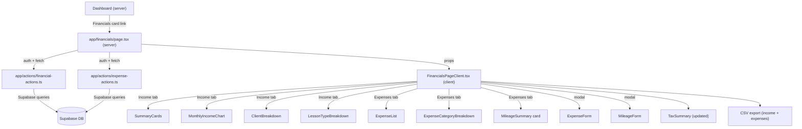

# Design Document: Coach Financials

## Overview

The Coach Financials feature adds a `/financials` route with income summaries, charts, breakdowns, and tax reporting. It follows the existing app architecture: a **server component** page that authenticates and fetches data via server actions, passing it to a **client component** for interactive rendering.

No new database tables or migrations are needed for Phase 1. All data is derived from existing `lessons`, `lesson_participants`, `clients`, and `lesson_types` tables. A new `recharts` dependency is added for charts.

**Phase 2** extends the Financials page with business expense tracking, mileage logging, and an updated tax summary showing net profit. This requires a new `expenses` database table, CRUD server actions, new UI components, and modifications to the existing `FinancialsPageClient` and `TaxSummary` components.

---

## Architecture



### Data Flow

1. **Server component** (`app/financials/page.tsx`) authenticates the user and calls both `getFinancialSummary(year)` and `getExpenseSummary(year)` server actions in parallel.
2. **Income server action** (`financial-actions.ts`) runs Supabase queries against `lessons`/`lesson_participants` and aggregates server-side (unchanged from Phase 1).
3. **Expense server action** (`expense-actions.ts`) runs Supabase queries against the new `expenses` table and aggregates into category breakdowns and monthly totals.
4. **Client component** (`FinancialsPageClient.tsx`) receives both datasets as props, manages tab state (`Income` / `Expenses`), and re-fetches via server actions when the year changes. Month filtering for expenses is client-side.
5. **Sub-components** render individual sections. The TaxSummary now receives both income and expense data to calculate net profit.

---

## Components and Interfaces

### File Structure (Phase 2 additions in bold)

```
app/
  financials/
    page.tsx                        # Modified: also fetch expense data
    FinancialsPageClient.tsx        # Modified: add tab bar + expense tab content
    MonthlyIncomeChart.tsx          # Unchanged
    ClientBreakdown.tsx             # Unchanged
    LessonTypeBreakdown.tsx         # Unchanged
    TaxSummary.tsx                  # Modified: show expenses, net profit, mileage
    ExpenseList.tsx                 # NEW: expense list (table on desktop, cards on mobile)
    ExpenseCategoryBreakdown.tsx    # NEW: category breakdown card
    ExpenseForm.tsx                 # NEW: add/edit expense modal form
    MileageForm.tsx                 # NEW: add mileage entry modal form
  actions/
    financial-actions.ts            # Unchanged
    expense-actions.ts              # NEW: CRUD + summary actions for expenses
lib/
  types/
    financial.ts                    # Unchanged
    expense.ts                      # NEW: expense type definitions
  validations/
    expense.ts                      # NEW: Zod schemas for expense validation
  constants/
    messages.ts                     # Modified: add EXPENSE error/success messages
    expense-categories.ts           # NEW: category definitions with colors
supabase/
  migrations/
    20260207_create_expenses.sql    # NEW: expenses table + RLS policies
```

### 1. Server Component Modification: `app/financials/page.tsx`

Add a parallel call to `getExpenseSummary(year)`:

```typescript
// Current:
const financialResult = await getFinancialSummary(currentYear);

// Updated:
const [financialResult, expenseResult] = await Promise.all([
  getFinancialSummary(currentYear),
  getExpenseSummary(currentYear),
]);
// Pass both to FinancialsPageClient as props
```

### 2. Client Component Modification: `app/financials/FinancialsPageClient.tsx`

Add tab state and expense management:

```typescript
interface FinancialsPageClientProps {
  initialData: FinancialData | null;
  initialExpenseData: ExpenseData | null;  // NEW
  initialYear: number;
  initialMonth: number;
  initialError: string | null;
}

// New state:
// - activeTab: 'income' | 'expenses' (default: 'income')
// - expenseData: ExpenseData | null
// - showExpenseForm: boolean (modal toggle)
// - showMileageForm: boolean (modal toggle)
// - editingExpense: Expense | null (null = creating, object = editing)
```

**Tab bar** renders between the header and main content as two buttons styled as pill tabs. The existing year/month selectors remain in the header and apply to both tabs.

**Income tab** renders exactly the existing content (summary cards, chart, breakdowns).

**Expenses tab** renders:
1. Summary cards row: Total Expenses (YTD), Monthly Expenses, Total Mileage (year)
2. "+ Add Expense" and "+ Add Mileage" action buttons
3. `ExpenseList` component with month-filtered expenses
4. `ExpenseCategoryBreakdown` component with year-scoped category totals

**Tax Summary** renders below both tabs (always visible) and now includes expense data.

**Year change** re-fetches both income and expense data in parallel. **Month change** filters both datasets client-side.

### 3. New Server Actions: `app/actions/expense-actions.ts`

```typescript
'use server';

// Fetch all expenses for a year, aggregated into ExpenseData shape
export async function getExpenseSummary(year: number): Promise<{
  success: boolean;
  error?: string;
  data?: ExpenseData;
}> {
  // 1. Authenticate user
  // 2. Query expenses WHERE coach_id = user.id AND date within year
  // 3. Aggregate into monthly totals, category breakdown, mileage summary
  // 4. Return structured response
}

// Create a new expense
export async function createExpense(input: CreateExpenseInput): Promise<{
  success: boolean;
  error?: string;
  data?: Expense;
}> {
  // 1. Authenticate user
  // 2. Validate with Zod schema
  // 3. Insert into expenses table with coach_id = user.id
  // 4. Return created expense
}

// Update an existing expense
export async function updateExpense(id: string, input: UpdateExpenseInput): Promise<{
  success: boolean;
  error?: string;
}> {
  // 1. Authenticate user
  // 2. Validate with Zod schema
  // 3. Update expense WHERE id = id AND coach_id = user.id
  // 4. Return success/error
}

// Delete an expense
export async function deleteExpense(id: string): Promise<{
  success: boolean;
  error?: string;
}> {
  // 1. Authenticate user
  // 2. Delete expense WHERE id = id AND coach_id = user.id
  // 3. Return success/error
}
```

**Query strategy** (same principle as income): Fetch all expense rows for the year in one query, aggregate in TypeScript. Expense volume per coach per year is low (tens to hundreds of rows).

### 4. New Type Definitions: `lib/types/expense.ts`

```typescript
export const EXPENSE_CATEGORIES = [
  'Equipment & Supplies',
  'Professional Development',
  'Technology & Software',
  'Transportation',
  'Facility & Venue Rental',
  'Insurance',
  'Marketing & Advertising',
  'Other',
] as const;

export type ExpenseCategory = typeof EXPENSE_CATEGORIES[number];

export interface Expense {
  id: string;
  coachId: string;
  date: string;            // YYYY-MM-DD
  amount: number;
  category: ExpenseCategory;
  description: string;
  receiptReference: string | null;
  isRecurring: boolean;
  isMileage: boolean;      // true if created via mileage form
  milesDriven: number | null;  // populated only for mileage entries
  createdAt: string;
  updatedAt: string;
}

export interface ExpenseData {
  year: number;
  expenses: Expense[];              // All expenses for the year (for list + CSV)
  monthlyExpenses: MonthlyExpense[];  // 12 entries, one per month
  categoryBreakdown: CategoryBreakdown[];
  totalExpenses: number;            // Sum of all expenses for the year
  totalMilesDriven: number;         // Sum of miles_driven for the year
  totalMileageDeduction: number;    // totalMilesDriven * IRS_MILEAGE_RATE
}

export interface MonthlyExpense {
  month: number;     // 0-11
  totalAmount: number;
  expenseCount: number;
}

export interface CategoryBreakdown {
  category: ExpenseCategory;
  color: string;
  expenseCount: number;
  totalAmount: number;
}

export interface ExpenseExportRow {
  date: string;
  category: string;
  description: string;
  amount: number;
  receiptReference: string;
}
```

### 5. New Validation: `lib/validations/expense.ts`

```typescript
import { z } from 'zod';
import { EXPENSE_CATEGORIES } from '@/lib/types/expense';

const expenseCategorySchema = z.enum(EXPENSE_CATEGORIES);

export const CreateExpenseSchema = z.object({
  date: z.string().regex(/^\d{4}-\d{2}-\d{2}$/, 'Invalid date format'),
  amount: z.number()
    .positive('Amount must be greater than 0')
    .max(100000, 'Amount cannot exceed $100,000'),
  category: expenseCategorySchema,
  description: z.string()
    .min(1, 'Description is required')
    .max(500, 'Description must be 500 characters or less')
    .trim(),
  receipt_reference: z.string().max(200).trim().nullable().optional(),
  is_recurring: z.boolean().optional().default(false),
}).strict();

export const CreateMileageSchema = z.object({
  date: z.string().regex(/^\d{4}-\d{2}-\d{2}$/, 'Invalid date format'),
  miles_driven: z.number()
    .positive('Miles must be greater than 0')
    .max(10000, 'Miles cannot exceed 10,000 per entry'),
  purpose: z.string()
    .min(1, 'Purpose is required')
    .max(500, 'Purpose must be 500 characters or less')
    .trim(),
}).strict();

export const UpdateExpenseSchema = CreateExpenseSchema.partial().extend({
  // Allow partial updates; at least one field must be provided
}).strict();
```

### 6. Category Constants: `lib/constants/expense-categories.ts`

```typescript
import type { ExpenseCategory } from '@/lib/types/expense';

export const EXPENSE_CATEGORY_COLORS: Record<ExpenseCategory, string> = {
  'Equipment & Supplies': '#F59E0B',      // amber
  'Professional Development': '#8B5CF6',  // violet
  'Technology & Software': '#3B82F6',     // blue
  'Transportation': '#10B981',            // emerald
  'Facility & Venue Rental': '#EC4899',   // pink
  'Insurance': '#6366F1',                // indigo
  'Marketing & Advertising': '#F97316',   // orange
  'Other': '#9CA3AF',                    // gray
};

export const IRS_MILEAGE_RATE = 0.70; // $/mile for 2026
```

### 7. New Components

#### `ExpenseList.tsx`

Displays expenses for the selected month as a list, with the same responsive pattern used by `ClientBreakdown`:

- **Desktop:** Table with columns: Date, Category (with color dot), Description, Amount, Receipt Ref
- **Mobile:** Compact cards showing date, category pill, description, and amount
- Each row/card is tappable to open the edit form (`onEditExpense(expense)`)
- For mileage entries, show "32 mi — $22.40" format instead of just the amount
- Sorted by date descending
- Empty state: "No expenses recorded for {month}. Tap '+ Add Expense' to get started."

#### `ExpenseCategoryBreakdown.tsx`

Displays year-scoped category totals:

- Same card container style as other breakdown components
- List of categories sorted by total amount descending
- Each row: color dot, category name, expense count, total amount
- Desktop: compact table. Mobile: stacked rows (no separate card layout needed — categories are few enough to fit)

#### `ExpenseForm.tsx`

Modal form for creating/editing expenses:

- Opens as a modal overlay (same pattern as lesson edit modal in CalendarPageClient)
- Fields: Date (DatePicker), Amount (number input), Category (select dropdown), Description (textarea), Receipt Reference (text input), Recurring (checkbox)
- When editing: pre-populate all fields, show "Delete Expense" button
- On submit: call `createExpense()` or `updateExpense()` server action
- On success: close modal, trigger data refresh via callback
- Validation: client-side required field checks + server-side Zod validation
- Loading state on submit button, error display at top of form

#### `MileageForm.tsx`

Simpler modal form for mileage entries:

- Fields: Date (DatePicker), Miles Driven (number input), Purpose/Destination (textarea)
- Shows auto-calculated deduction amount below miles input: "Deduction: $22.40 (32 mi × $0.70)"
- On submit: calls `createExpense()` with `category: 'Transportation'`, `is_mileage: true`, `miles_driven: value`, `amount: miles * IRS_MILEAGE_RATE`, `description: purpose`
- Same modal pattern, loading state, and error handling as ExpenseForm

### 8. TaxSummary Modification

Extend the existing `TaxSummary` component to accept expense data:

```typescript
interface TaxSummaryProps {
  data: TaxSummaryType | null;
  lessonDetails: LessonExportRow[];
  expenseData: ExpenseData | null;   // NEW
  year: number;
}
```

**New sections added below existing content:**

1. **Expense Summary row** (if expenses exist):
   - Total Expenses: sum of all expense amounts for the year
   - Net Profit: grossIncome - totalExpenses (highlighted, this is Schedule C Line 31)

2. **Expense Category Breakdown** (compact list):
   - Each Schedule C-aligned category with its total, for easy tax prep reference

3. **Mileage Summary** (if mileage entries exist):
   - Total Miles Driven: sum of `miles_driven` for the year
   - Total Mileage Deduction: totalMiles × $0.70

4. **Updated CSV Export:**
   - CSV now has two sections separated by a blank row:
     - **INCOME** section: same columns as before (Date, Client Name, Lesson Type, Duration, Amount Paid, Payment Status)
     - **EXPENSES** section: Date, Category, Description, Amount, Receipt Reference
   - Filename changes to `shift-tax-summary-{year}.csv`
   - If no expenses, income-only CSV is exported (backward compatible)

---

## Data Models

### New Table: `expenses`

```sql
CREATE TABLE expenses (
  id UUID PRIMARY KEY DEFAULT gen_random_uuid(),
  coach_id UUID NOT NULL REFERENCES auth.users(id) ON DELETE CASCADE,
  date DATE NOT NULL,
  amount DECIMAL(10,2) NOT NULL CHECK (amount > 0),
  category TEXT NOT NULL,
  description TEXT NOT NULL DEFAULT '',
  receipt_reference TEXT,
  is_recurring BOOLEAN NOT NULL DEFAULT FALSE,
  is_mileage BOOLEAN NOT NULL DEFAULT FALSE,
  miles_driven DECIMAL(10,2),
  created_at TIMESTAMPTZ NOT NULL DEFAULT NOW(),
  updated_at TIMESTAMPTZ NOT NULL DEFAULT NOW()
);
```

**Indexes:**
```sql
CREATE INDEX idx_expenses_coach_id ON expenses(coach_id);
CREATE INDEX idx_expenses_date ON expenses(date);
CREATE INDEX idx_expenses_coach_date ON expenses(coach_id, date);
```

**RLS Policies:**
```sql
ALTER TABLE expenses ENABLE ROW LEVEL SECURITY;

CREATE POLICY "Coaches can view own expenses"
  ON expenses FOR SELECT USING (coach_id = auth.uid());

CREATE POLICY "Coaches can create own expenses"
  ON expenses FOR INSERT WITH CHECK (coach_id = auth.uid());

CREATE POLICY "Coaches can update own expenses"
  ON expenses FOR UPDATE
  USING (coach_id = auth.uid())
  WITH CHECK (coach_id = auth.uid());

CREATE POLICY "Coaches can delete own expenses"
  ON expenses FOR DELETE USING (coach_id = auth.uid());
```

**Auto-update `updated_at` trigger:**
```sql
CREATE TRIGGER update_expenses_updated_at
  BEFORE UPDATE ON expenses
  FOR EACH ROW
  EXECUTE FUNCTION moddatetime(updated_at);
```

### Existing Tables (unchanged)

| Table | Fields Used | Purpose |
|-------|-----------|---------|
| `lessons` | `id`, `coach_id`, `start_time`, `end_time`, `status`, `rate_at_booking`, `lesson_type_id`, `client_id` | Lesson dates, durations, status filtering |
| `lesson_participants` | `lesson_id`, `client_id`, `amount_owed`, `payment_status`, `paid_at` | Income amounts, payment tracking |
| `lesson_types` | `id`, `name`, `color`, `hourly_rate` | Lesson type names and colors for breakdown |
| `clients` | `id`, `first_name`, `last_name` | Client names for breakdown |

### Column Design Decisions

- **`category` as TEXT** (not enum): Categories may evolve over time; TEXT with application-level validation is more flexible than a Postgres enum that requires migrations to change.
- **`is_mileage` + `miles_driven`**: Mileage entries are stored in the same table as regular expenses (both are deductible costs). The `is_mileage` flag and `miles_driven` field distinguish them for display and mileage summary calculation. The `amount` is auto-calculated (miles × rate) and stored, so historical entries remain accurate even if the IRS rate changes.
- **`is_recurring` as flag only**: Marks an expense for reference (e.g., "monthly software subscription") but does NOT auto-generate future entries. Coaches manually add each expense as needed. This keeps the feature simple.
- **No `receipt_url`**: Per tax research, IRS doesn't require receipt photos for expenses under $75, and Supabase free tier storage is limited (1 GB). The text-based `receipt_reference` field (e.g., "Amazon order #123") provides adequate record-keeping. Photo uploads deferred to a future phase.

---

## Error Handling

| Scenario | Handling |
|----------|----------|
| User not authenticated | Server component redirects to `/login` (same pattern as dashboard) |
| Server action fails | Return `{ success: false, error: string }`, client shows error banner with retry button |
| No income data for selected period | Show `$0.00` / `0` values with empty-state messaging |
| No expenses for selected period | Show empty-state message: "No expenses recorded for {month}. Tap '+ Add Expense' to get started." |
| Year change while loading | Show loading spinner; disable tab switching during load |
| CSV export with no data | Show alert "No data to export for {year}" |
| Expense form validation error | Show inline error messages below each field (client-side). Server-side Zod errors shown at top of form. |
| Delete expense confirmation | Show confirmation dialog: "Delete this expense? This cannot be undone." |
| Supabase query error | Log server-side, return generic error message to client |
| Negative net profit | Display in red (valid scenario — coach may have more expenses than income) |

---

## Testing Strategy

### Unit Tests
- **Income aggregation logic:** (unchanged from Phase 1)
- **Expense aggregation logic:** Test category grouping, monthly totals, mileage calculation
- **Mileage calculation:** Verify `miles × IRS_MILEAGE_RATE` produces correct deduction
- **Net profit calculation:** grossIncome − totalExpenses, including edge cases (zero income, zero expenses, negative net profit)
- **CSV export:** Verify combined income+expense CSV has correct sections, headers, and data

### Integration Tests
- **Expense CRUD actions:** Test create, read, update, delete with mocked Supabase client
  - Verify auth check on all actions
  - Verify Zod validation rejects invalid input
  - Verify RLS-equivalent coach_id filtering
- **`getExpenseSummary()`:** Verify date range filtering, category aggregation, mileage summary

### Component Tests
- **ExpenseForm:** Render, fill fields, submit, verify server action called with correct data
- **MileageForm:** Verify auto-calculation display, submit creates Transportation expense
- **ExpenseList:** Render with data, verify sorting, verify mileage display format
- **ExpenseCategoryBreakdown:** Verify sorted by amount, color indicators shown
- **TaxSummary (updated):** Verify net profit display, mileage summary, combined CSV button

### Manual Testing
- Create, edit, and delete expenses on both desktop and mobile
- Add mileage entries and verify auto-calculation
- Switch between Income and Expenses tabs
- Change month/year selectors and verify both tabs update
- Export CSV and verify it opens correctly with both sections
- Verify dark mode styling on all new components
- Test on mobile viewport: form modals should scroll properly, cards should stack
