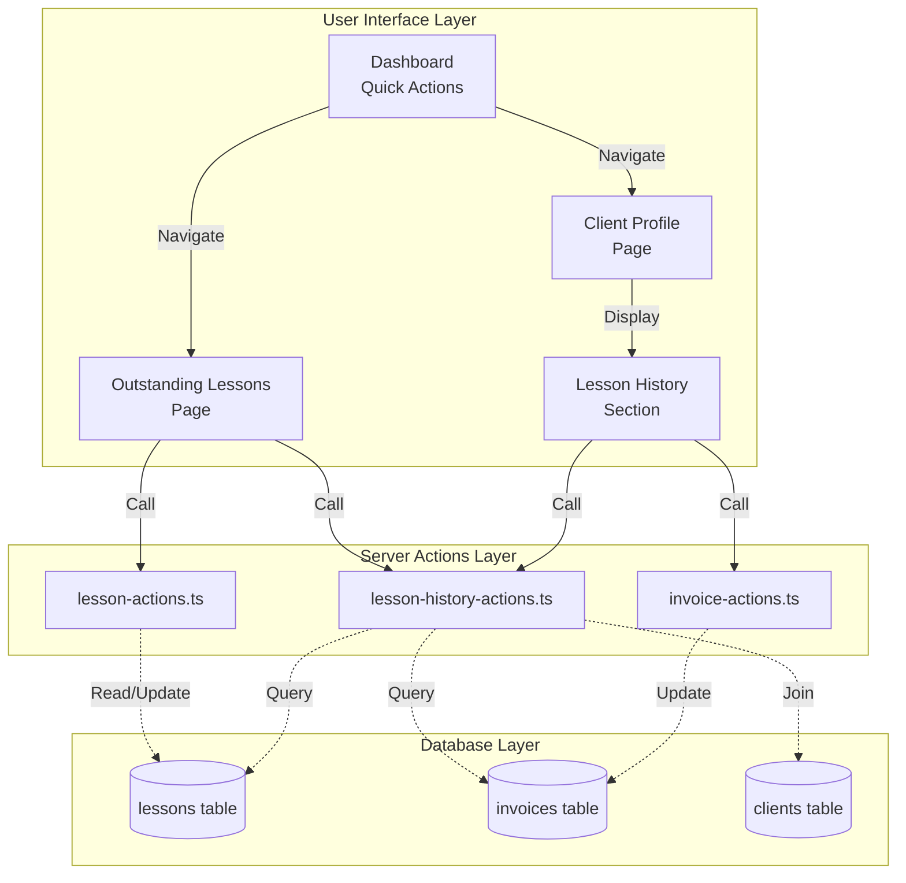
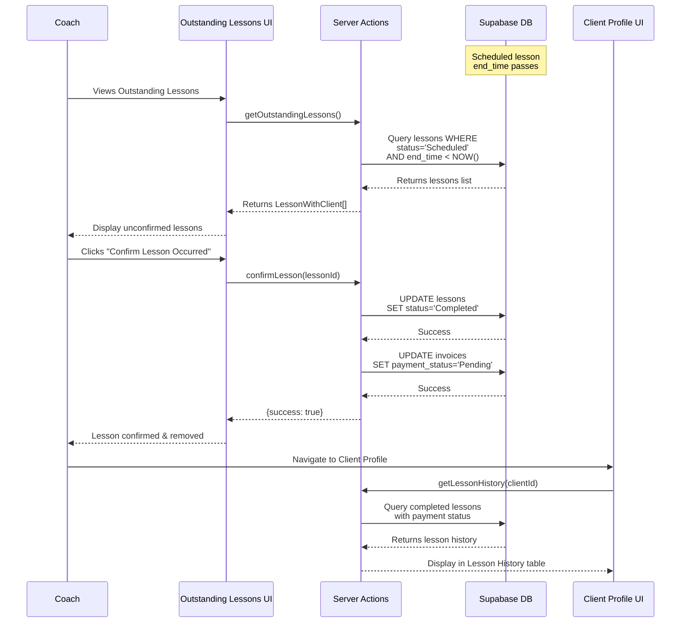
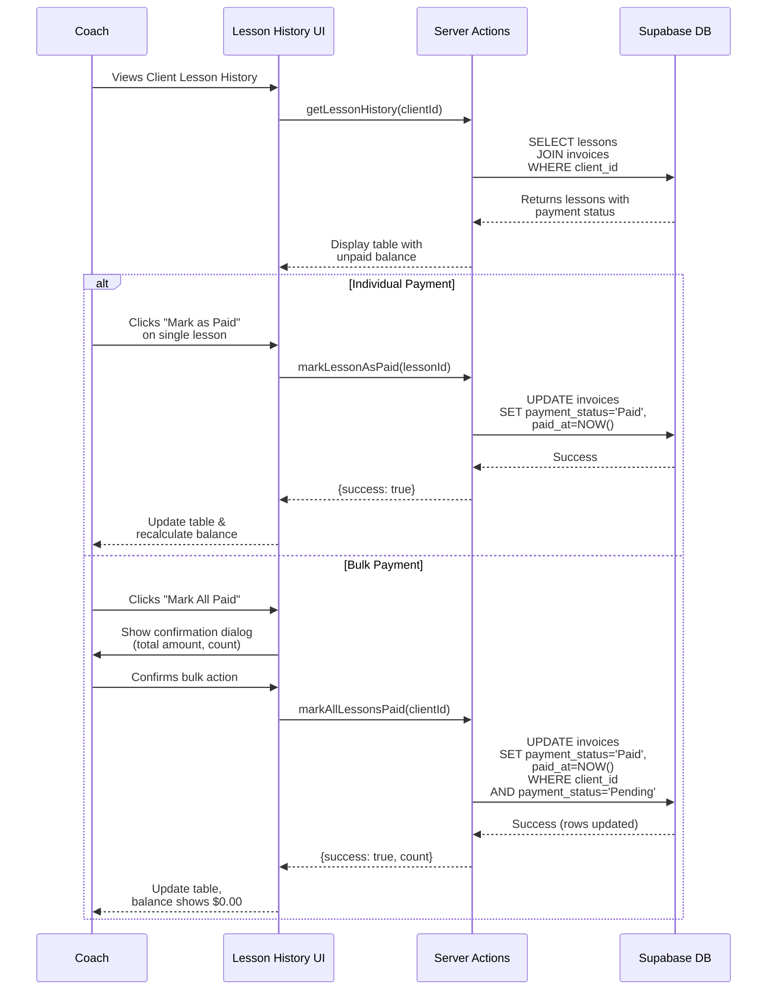

# Design Document: Lesson History Feature

## Overview

The Lesson History feature creates a critical link between the Calendar and Client Profile systems by implementing a two-step workflow for tracking and managing lesson payments. The feature consists of two main components:

1. **Outstanding Lessons Dashboard**: A centralized view where coaches confirm that scheduled lessons actually occurred
2. **Lesson History Section**: An enhanced Client Profile section displaying confirmed lessons with payment tracking and management capabilities

This design leverages the existing Supabase infrastructure, lessons table, and invoices table to minimize new database structures while adding the necessary workflow and UI layers.

### System Boundaries

**In Scope:**
- Outstanding Lessons dashboard with lesson confirmation workflow
- Lesson History table within Client Profile with filtering and sorting
- Individual and bulk payment status management
- Unpaid balance calculations and display
- Session detail viewing and note-taking capabilities

**Out of Scope:**
- Automated invoice generation (already exists in current system)
- Payment processing integration
- Email notifications for unpaid lessons
- Reporting and analytics dashboards

## Architecture

### High-Level Architecture



### Data Flow: Lesson Confirmation Workflow



### Data Flow: Payment Status Management



## Components and Interfaces

### 1. Outstanding Lessons Dashboard

#### Component Structure
```
/app/outstanding-lessons/
├── page.tsx (Server Component)
└── OutstandingLessonsClient.tsx (Client Component)
```

#### Server Component Responsibilities
- Authentication check and redirect
- Initial user verification
- Pass coachId to client component

#### Client Component UI Structure
```typescript
interface OutstandingLessonsClientProps {
  coachId: string;
}

// State management
const [outstandingLessons, setOutstandingLessons] = useState<LessonWithClient[]>([]);
const [isLoading, setIsLoading] = useState(true);
const [error, setError] = useState<string | null>(null);
```

#### UI Layout
```
┌─────────────────────────────────────────────┐
│  Outstanding Lessons                    [3] │ <- Notification badge
├─────────────────────────────────────────────┤
│                                             │
│  ┌─────────────────────────────────────┐   │
│  │ Client: John Smith                  │   │
│  │ Date: Dec 15, 2025 • 10:00 AM      │   │
│  │ Service: 60 min training            │   │
│  │ Cost: $75.00                        │   │
│  │                                     │   │
│  │ [Confirm Occurred] [Mark No-Show]  │   │
│  └─────────────────────────────────────┘   │
│                                             │
│  ┌─────────────────────────────────────┐   │
│  │ Client: Sarah Johnson              │   │
│  │ Date: Dec 14, 2025 • 2:00 PM       │   │
│  │ Service: 90 min consultation        │   │
│  │ Cost: $112.50                       │   │
│  │                                     │   │
│  │ [Confirm Occurred] [Mark No-Show]  │   │
│  └─────────────────────────────────────┘   │
│                                             │
└─────────────────────────────────────────────┘
```

#### Styling Classes (Tailwind)
- Container: `max-w-7xl mx-auto px-4 py-8`
- Card: `bg-white dark:bg-gray-800 rounded-lg shadow-md p-6 mb-4`
- Badge: `bg-red-500 text-white rounded-full px-2 py-1 text-sm`
- Primary Button: `bg-indigo-600 hover:bg-indigo-700 text-white px-4 py-2 rounded-lg`
- Secondary Button: `bg-gray-200 hover:bg-gray-300 text-gray-800 px-4 py-2 rounded-lg`

### 2. Lesson History Section (Client Profile Enhancement)

#### Component Structure
```
/app/clients/[id]/
├── page.tsx (existing, enhanced)
├── ClientDetailClient.tsx (existing, enhanced)
└── components/
    ├── LessonHistoryTable.tsx (new)
    └── LessonDetailModal.tsx (new)
```

#### Enhanced Client Detail Component
```typescript
// Add to existing ClientDetailClient.tsx

interface LessonHistoryEntry {
  id: string;
  date: string;
  time: string;
  serviceType: string;
  duration: number;
  rate: number;
  paymentStatus: 'Pending' | 'Paid';
  paidAt?: string | null;
  notes?: string;
}

// New state
const [lessonHistory, setLessonHistory] = useState<LessonHistoryEntry[]>([]);
const [filteredHistory, setFilteredHistory] = useState<LessonHistoryEntry[]>([]);
const [paymentFilter, setPaymentFilter] = useState<'All' | 'Pending' | 'Paid'>('All');
const [sortBy, setSortBy] = useState<'date' | 'status'>('date');
const [sortOrder, setSortOrder] = useState<'asc' | 'desc'>('desc');
const [unpaidBalance, setUnpaidBalance] = useState(0);
```

#### LessonHistoryTable Component UI
```
┌──────────────────────────────────────────────────────────────┐
│  Lesson History                                              │
│                                                              │
│  Outstanding Balance: $225.00     [Mark All Paid]          │
├──────────────────────────────────────────────────────────────┤
│  Filter: [All ▼] [Pending] [Paid]    Sort: [Date ▼]        │
├──────────────────────────────────────────────────────────────┤
│  Date       Time    Service Type     Duration  Rate  Status │
├──────────────────────────────────────────────────────────────┤
│  Dec 15  10:00 AM  60 min training   1.0 hrs  $75   Pending│
│                                       [View Details] [Mark Paid]│
├──────────────────────────────────────────────────────────────┤
│  Dec 12   2:00 PM  60 min training   1.0 hrs  $75   Pending│
│                                       [View Details] [Mark Paid]│
├──────────────────────────────────────────────────────────────┤
│  Dec 10   4:00 PM  60 min training   1.0 hrs  $75   Pending│
│                                       [View Details] [Mark Paid]│
├──────────────────────────────────────────────────────────────┤
│  Dec 8    10:00 AM  90 min consult   1.5 hrs  $112  Paid ✓ │
│                                       [View Details]            │
└──────────────────────────────────────────────────────────────┘
```

#### Lesson Detail Modal
```
┌─────────────────────────────────────────┐
│  Lesson Details                    [×] │
├─────────────────────────────────────────┤
│  Client: John Smith                    │
│  Date: December 15, 2025               │
│  Time: 10:00 AM - 11:00 AM            │
│  Duration: 1.0 hours                   │
│  Service: 60 min training              │
│  Location: Main Gym                    │
│  Rate: $75.00                          │
│  Payment Status: Pending               │
│                                        │
│  Notes:                                │
│  ┌───────────────────────────────────┐ │
│  │ [Existing notes or placeholder]  │ │
│  │                                   │ │
│  └───────────────────────────────────┘ │
│                                        │
│  [Add Note] [Mark as Paid] [Close]    │
└─────────────────────────────────────────┘
```

### 3. Dashboard Integration

#### Enhanced Dashboard Quick Actions
```typescript
// Add to /app/dashboard/page.tsx

<Link href="/outstanding-lessons">
  <div className="bg-yellow-50 dark:bg-yellow-900/20 rounded-lg p-6">
    <h3 className="text-lg font-semibold mb-2">
      Outstanding Lessons
      {outstandingCount > 0 && (
        <span className="ml-2 bg-red-500 text-white rounded-full px-2 py-1 text-sm">
          {outstandingCount}
        </span>
      )}
    </h3>
    <p className="text-gray-600 dark:text-gray-400">
      Confirm completed lessons
    </p>
  </div>
</Link>
```

## Data Models

### Existing Database Schema (No Changes Required)

The existing schema already supports all required functionality:

#### Lessons Table
```sql
CREATE TABLE lessons (
  id UUID PRIMARY KEY DEFAULT uuid_generate_v4(),
  coach_id UUID NOT NULL REFERENCES auth.users(id),
  client_id UUID NOT NULL REFERENCES clients(id),
  title TEXT NOT NULL,
  description TEXT,
  start_time TIMESTAMP WITH TIME ZONE NOT NULL,
  end_time TIMESTAMP WITH TIME ZONE NOT NULL,
  location TEXT,
  rate_at_booking NUMERIC NOT NULL,
  duration_hours NUMERIC GENERATED ALWAYS AS (
    EXTRACT(EPOCH FROM (end_time - start_time)) / 3600
  ) STORED,
  status lesson_status NOT NULL DEFAULT 'Scheduled',
  cancelled_at TIMESTAMP WITH TIME ZONE,
  cancelled_reason TEXT,
  created_at TIMESTAMP WITH TIME ZONE DEFAULT NOW(),
  updated_at TIMESTAMP WITH TIME ZONE DEFAULT NOW()
);

CREATE TYPE lesson_status AS ENUM (
  'Scheduled',
  'Completed',
  'Cancelled',
  'No Show'
);
```

**Key Fields for Feature:**
- `status`: Used to identify outstanding lessons (`'Scheduled'` + past `end_time`)
- `end_time`: Determines when lesson should appear in Outstanding queue
- `rate_at_booking`: Captured cost for payment tracking
- `duration_hours`: Auto-calculated for display

#### Invoices Table
```sql
CREATE TABLE invoices (
  id UUID PRIMARY KEY DEFAULT uuid_generate_v4(),
  lesson_id UUID NOT NULL UNIQUE REFERENCES lessons(id),
  client_id UUID NOT NULL REFERENCES clients(id),
  coach_id UUID NOT NULL REFERENCES auth.users(id),
  invoice_number TEXT UNIQUE NOT NULL,
  amount_due NUMERIC NOT NULL,
  due_date DATE NOT NULL,
  payment_status payment_status NOT NULL DEFAULT 'Pending',
  paid_at TIMESTAMP WITH TIME ZONE,
  created_at TIMESTAMP WITH TIME ZONE DEFAULT NOW(),
  updated_at TIMESTAMP WITH TIME ZONE DEFAULT NOW()
);

CREATE TYPE payment_status AS ENUM (
  'Pending',
  'Paid',
  'Overdue',
  'Canceled'
);
```

**Key Fields for Feature:**
- `payment_status`: Primary field for payment tracking
- `paid_at`: Records when payment was confirmed
- One-to-one relationship with lessons via `lesson_id`

### TypeScript Interfaces

#### New Type Definitions (Add to `/lib/types/lesson.ts`)

```typescript
// Outstanding Lessons View Model
export interface OutstandingLesson extends LessonWithClient {
  // All fields from LessonWithClient
  // Plus convenience properties for UI
  displayDate: string; // "Dec 15, 2025"
  displayTime: string; // "10:00 AM - 11:00 AM"
  formattedCost: string; // "$75.00"
}

// Lesson History Entry (combines lesson + invoice data)
export interface LessonHistoryEntry {
  lessonId: string;
  invoiceId: string;
  date: string; // ISO 8601 date portion
  startTime: string; // ISO 8601 datetime
  endTime: string; // ISO 8601 datetime
  serviceType: string; // lesson.title
  duration: number; // hours
  rate: number; // rate_at_booking
  paymentStatus: 'Pending' | 'Paid' | 'Overdue' | 'Canceled';
  paidAt?: string | null;
  notes?: string;
  location?: string;
}

// Lesson History Summary
export interface LessonHistorySummary {
  totalLessons: number;
  completedLessons: number;
  pendingPayments: number;
  unpaidBalance: number; // sum of all pending/overdue amounts
}

// Filter and Sort Options
export interface LessonHistoryFilters {
  paymentStatus?: 'All' | 'Pending' | 'Paid' | 'Overdue';
  dateFrom?: string;
  dateTo?: string;
}

export interface LessonHistorySortOptions {
  sortBy: 'date' | 'status' | 'amount';
  sortOrder: 'asc' | 'desc';
}
```

### Query Patterns

#### Get Outstanding Lessons Query
```typescript
// Pattern for querying outstanding lessons
const { data, error } = await supabase
  .from('lessons')
  .select(`
    *,
    client:clients (
      id,
      athlete_name,
      parent_email,
      parent_phone
    )
  `)
  .eq('coach_id', user.id)
  .eq('status', 'Scheduled')
  .lt('end_time', new Date().toISOString())
  .order('end_time', { ascending: true });
```

#### Get Lesson History Query
```typescript
// Pattern for querying lesson history with payment info
const { data, error } = await supabase
  .from('lessons')
  .select(`
    id,
    title,
    start_time,
    end_time,
    location,
    rate_at_booking,
    duration_hours,
    status,
    invoices (
      id,
      payment_status,
      paid_at,
      amount_due
    )
  `)
  .eq('coach_id', user.id)
  .eq('client_id', clientId)
  .eq('status', 'Completed')
  .order('start_time', { ascending: false });
```

#### Calculate Unpaid Balance Query
```typescript
// Pattern for calculating unpaid balance
const { data, error } = await supabase
  .from('invoices')
  .select('amount_due')
  .eq('coach_id', user.id)
  .eq('client_id', clientId)
  .in('payment_status', ['Pending', 'Overdue']);

const unpaidBalance = data?.reduce((sum, inv) => sum + inv.amount_due, 0) || 0;
```

## Error Handling

### Error Scenarios and Responses

#### 1. Outstanding Lessons Fetch Errors
**Scenario:** Database query fails when loading outstanding lessons
```typescript
{
  success: false,
  error: ERROR_MESSAGES.LESSON.FETCH_FAILED
}
```
**UI Response:** Display error banner with retry button

#### 2. Lesson Confirmation Errors
**Scenario:** Status update fails when confirming lesson
```typescript
{
  success: false,
  error: "Failed to confirm lesson. Please try again."
}
```
**UI Response:** Keep lesson in outstanding list, show toast notification

#### 3. Payment Status Update Errors
**Scenario:** Invoice update fails when marking as paid
```typescript
{
  success: false,
  error: ERROR_MESSAGES.INVOICE.UPDATE_FAILED
}
```
**UI Response:** Revert optimistic UI update, show error message

#### 4. Bulk Payment Errors
**Scenario:** Partial failure during bulk payment update
```typescript
{
  success: false,
  error: "Some payments could not be updated. Please refresh and try again.",
  partialSuccess: {
    updated: 3,
    failed: 2
  }
}
```
**UI Response:** Show partial success message, refresh data

#### 5. Authentication Errors
**Scenario:** User session expires during action
```typescript
{
  success: false,
  error: ERROR_MESSAGES.AUTH.NOT_LOGGED_IN
}
```
**UI Response:** Redirect to login with return URL

#### 6. Authorization Errors
**Scenario:** User attempts to modify another coach's data
```typescript
{
  success: false,
  error: ERROR_MESSAGES.AUTH.UNAUTHORIZED
}
```
**UI Response:** Display unauthorized message, redirect to dashboard

### Error Message Constants (Add to `/lib/constants/messages.ts`)

```typescript
export const ERROR_MESSAGES = {
  // ... existing messages
  LESSON_HISTORY: {
    FETCH_FAILED: 'Failed to load lesson history. Please try again.',
    CONFIRM_FAILED: 'Failed to confirm lesson. Please try again.',
    NO_OUTSTANDING: 'No outstanding lessons to confirm.',
  },
  PAYMENT: {
    MARK_PAID_FAILED: 'Failed to mark lesson as paid. Please try again.',
    BULK_UPDATE_FAILED: 'Failed to update payment status for some lessons.',
    REVERT_FAILED: 'Failed to revert payment status. Please contact support.',
  }
};

export const SUCCESS_MESSAGES = {
  // ... existing messages
  LESSON_HISTORY: {
    CONFIRMED: 'Lesson confirmed successfully.',
    MARKED_NO_SHOW: 'Lesson marked as no-show.',
  },
  PAYMENT: {
    MARKED_PAID: 'Lesson marked as paid.',
    BULK_PAID: (count: number) => `${count} lesson${count > 1 ? 's' : ''} marked as paid.`,
  }
};
```

### Validation Rules

#### Lesson Confirmation Validation
```typescript
// Server-side validation in confirmLesson action
function validateLessonConfirmation(lesson: Lesson): ValidationError[] {
  const errors: ValidationError[] = [];

  if (lesson.status !== 'Scheduled') {
    errors.push({
      field: 'status',
      message: 'Only scheduled lessons can be confirmed.'
    });
  }

  if (new Date(lesson.end_time) > new Date()) {
    errors.push({
      field: 'end_time',
      message: 'Cannot confirm a lesson that has not ended yet.'
    });
  }

  return errors;
}
```

#### Payment Status Update Validation
```typescript
// Server-side validation in markLessonAsPaid action
function validatePaymentStatusUpdate(lesson: Lesson): ValidationError[] {
  const errors: ValidationError[] = [];

  if (lesson.status !== 'Completed') {
    errors.push({
      field: 'status',
      message: 'Only completed lessons can be marked as paid.'
    });
  }

  return errors;
}
```

## Testing Strategy

### Unit Tests

#### Server Actions Tests (`__tests__/actions/lesson-history-actions.test.ts`)

**Test Coverage:**
1. **getOutstandingLessons()**
   - Returns only scheduled lessons past end_time
   - Filters by coach_id correctly
   - Includes client relationship data
   - Returns empty array when no outstanding lessons
   - Handles database errors gracefully

2. **confirmLesson(lessonId)**
   - Updates lesson status to 'Completed'
   - Maintains invoice payment_status
   - Rejects if lesson already confirmed
   - Rejects if lesson belongs to different coach
   - Returns proper error for invalid lesson ID

3. **markLessonNoShow(lessonId)**
   - Updates lesson status to 'No Show'
   - Updates invoice to 'Canceled' status
   - Validates coach ownership

4. **getLessonHistory(clientId, filters?)**
   - Returns completed lessons with invoice data
   - Applies payment status filter correctly
   - Applies date range filter correctly
   - Sorts by date and status correctly
   - Calculates unpaid balance accurately

5. **markLessonAsPaid(lessonId)**
   - Updates invoice payment_status to 'Paid'
   - Sets paid_at timestamp
   - Validates lesson is completed
   - Rejects if already paid

6. **markAllLessonsPaid(clientId)**
   - Updates all pending invoices for client
   - Returns count of updated records
   - Uses transaction for consistency
   - Validates coach ownership
   - Handles partial failures

**Test Pattern Example:**
```typescript
describe('confirmLesson', () => {
  it('should update lesson status to Completed', async () => {
    // Arrange
    const mockLesson = createMockLesson({ status: 'Scheduled' });
    jest.spyOn(supabase, 'from').mockReturnValue(...);

    // Act
    const result = await confirmLesson(mockLesson.id);

    // Assert
    expect(result.success).toBe(true);
    expect(supabase.from).toHaveBeenCalledWith('lessons');
    expect(result.message).toBe(SUCCESS_MESSAGES.LESSON_HISTORY.CONFIRMED);
  });
});
```

### Integration Tests

#### Outstanding Lessons Workflow (`__tests__/integration/outstanding-lessons.test.ts`)

**Test Scenarios:**
1. Full workflow: Schedule lesson → Time passes → Appears in outstanding → Confirm → Appears in history
2. No-show workflow: Schedule lesson → Mark no-show → Does not appear in history
3. Multiple coaches: Ensure coach A cannot see coach B's outstanding lessons
4. Concurrent confirmations: Two coaches confirming different lessons simultaneously

#### Payment Status Workflow (`__tests__/integration/payment-tracking.test.ts`)

**Test Scenarios:**
1. Individual payment: Confirm lesson → Mark as paid → Balance updates
2. Bulk payment: Multiple unpaid lessons → Mark all paid → Balance = $0
3. Filter and sort: Verify filtering by status and sorting by date works correctly
4. Payment revert: Mark paid → Revert to pending → Balance recalculates

### Component Tests

#### OutstandingLessonsClient Component (`__tests__/components/OutstandingLessonsClient.test.tsx`)

**Test Coverage:**
1. Renders loading state initially
2. Displays list of outstanding lessons correctly
3. Confirm button calls confirmLesson action
4. No-show button calls markLessonNoShow action
5. Shows empty state when no outstanding lessons
6. Displays error message on fetch failure
7. Updates UI optimistically on confirm action

#### LessonHistoryTable Component (`__tests__/components/LessonHistoryTable.test.tsx`)

**Test Coverage:**
1. Renders table with lesson data correctly
2. Filter dropdown changes filtered results
3. Sort controls reorder table rows
4. Unpaid balance displays correctly
5. Mark as Paid button calls server action
6. Mark All Paid button shows confirmation dialog
7. View Details opens modal with lesson info

### E2E Tests (Optional with Playwright/Cypress)

#### Outstanding Lessons E2E
1. Login as coach → Navigate to outstanding lessons → Confirm lesson → Verify removal
2. Login as coach → Outstanding lesson exists → Mark no-show → Verify removal

#### Payment Tracking E2E
1. Login as coach → Open client profile → View lesson history → Mark lesson paid → Verify balance update
2. Login as coach → Client has 3 unpaid lessons → Mark all paid → Verify all updated

### Performance Tests

#### Load Testing
1. **Outstanding Lessons with 50+ entries:** Page load time < 2 seconds
2. **Lesson History with 100+ entries:** Table render time < 1 second
3. **Bulk payment update of 20 lessons:** Complete within 3 seconds

#### Stress Testing
1. Concurrent confirmations by multiple coaches
2. Rapid filtering/sorting changes in lesson history table

### Test Data Setup

```typescript
// Test fixtures for consistent test data
export const createMockLesson = (overrides?: Partial<Lesson>): Lesson => ({
  id: 'lesson-1',
  coach_id: 'coach-1',
  client_id: 'client-1',
  title: '60 min training',
  start_time: '2025-12-15T10:00:00Z',
  end_time: '2025-12-15T11:00:00Z',
  rate_at_booking: 75,
  duration_hours: 1,
  status: 'Scheduled',
  created_at: '2025-12-01T10:00:00Z',
  updated_at: '2025-12-01T10:00:00Z',
  ...overrides
});

export const createMockInvoice = (overrides?: Partial<Invoice>): Invoice => ({
  id: 'invoice-1',
  lesson_id: 'lesson-1',
  client_id: 'client-1',
  coach_id: 'coach-1',
  invoice_number: 'INV-001',
  amount_due: 75,
  due_date: '2025-12-22',
  payment_status: 'Pending',
  created_at: '2025-12-15T11:00:00Z',
  updated_at: '2025-12-15T11:00:00Z',
  ...overrides
});
```

## Implementation Notes

### Phased Implementation Approach

#### Phase 1: Outstanding Lessons Dashboard
1. Create Outstanding Lessons page structure
2. Implement getOutstandingLessons server action
3. Build OutstandingLessonsClient component with confirm/no-show actions
4. Add dashboard navigation link
5. Implement notification badge with count

**Validation:** Coach can see and confirm scheduled past lessons

#### Phase 2: Lesson History Display
1. Enhance Client Profile with Lesson History section
2. Implement getLessonHistory server action
3. Build LessonHistoryTable component
4. Add filtering and sorting controls
5. Implement unpaid balance calculation

**Validation:** Coach can view complete lesson history with payment status

#### Phase 3: Payment Management
1. Implement markLessonAsPaid server action
2. Add Mark as Paid buttons to table rows
3. Implement markAllLessonsPaid server action
4. Build confirmation dialog for bulk payment
5. Add real-time balance updates

**Validation:** Coach can mark individual and bulk payments

#### Phase 4: Lesson Details & Notes
1. Build LessonDetailModal component
2. Implement View Details action
3. Add note-taking functionality to modal
4. Persist notes to lessons table

**Validation:** Coach can view details and add notes

### Optimization Considerations

#### 1. Query Performance
- Add composite index on `(coach_id, status, end_time)` for outstanding lessons query
- Add composite index on `(client_id, status, start_time)` for lesson history query
- Consider pagination for clients with 100+ lessons

#### 2. Real-Time Updates
- Use Supabase Realtime subscriptions for Outstanding Lessons count badge
- Implement optimistic UI updates for payment status changes
- Debounce filter/sort changes to reduce re-renders

#### 3. Caching Strategy
- Cache unpaid balance calculation with 5-minute TTL
- Use SWR or React Query for client-side caching of lesson history
- Implement stale-while-revalidate pattern for better UX

#### 4. Mobile Responsiveness
- Use responsive table design with horizontal scroll on mobile
- Convert filter/sort controls to collapsible sections on small screens
- Stack lesson history table rows vertically on mobile

### Security Considerations

#### Row-Level Security (RLS)
- All queries automatically filtered by `coach_id` via existing RLS policies
- No additional RLS policies needed (leverage existing policies on lessons and invoices tables)

#### Authorization Checks
- Server actions validate coach ownership before any updates
- Client-side checks prevent UI display of unauthorized actions
- Double-validation pattern: RLS + explicit coach_id check

#### Data Privacy
- No client payment information exposed in URLs
- All sensitive actions require authenticated session
- Payment confirmations logged with timestamp for audit trail

### Migration and Rollback

#### Database Migrations
**None required** - existing schema fully supports all functionality

#### Feature Flags (Optional)
```typescript
// lib/feature-flags.ts
export const FEATURES = {
  LESSON_HISTORY: {
    OUTSTANDING_LESSONS: true,
    BULK_PAYMENT: true,
    LESSON_NOTES: true,
  }
};
```

#### Rollback Plan
1. Remove navigation links from dashboard
2. Hide Lesson History section from Client Profile
3. No database rollback needed (no schema changes)
4. Feature can be disabled without data loss

### Documentation Requirements

#### Code Documentation
- JSDoc comments for all server actions
- Component prop documentation with TypeScript interfaces
- Inline comments for complex query logic

#### User Documentation
- Coach guide: "How to confirm lessons"
- Coach guide: "Managing payment status"
- FAQ: "What happens if I mark a lesson as no-show?"

---

## Summary

This design leverages the existing Supabase infrastructure, lessons table, and invoices table to implement a comprehensive lesson tracking and payment management system. By using the existing `status` field on lessons and `payment_status` field on invoices, the implementation requires no database schema changes while providing a robust two-step workflow for coaches to confirm lessons and track payments.

The architecture follows established patterns in the codebase:
- Server Components for authentication and initial data fetching
- Client Components for interactivity
- Server Actions for all data mutations
- Tailwind CSS for consistent styling
- RLS policies for security

The phased implementation approach allows for incremental delivery and validation at each stage, ensuring the feature meets requirements before proceeding to the next phase.
