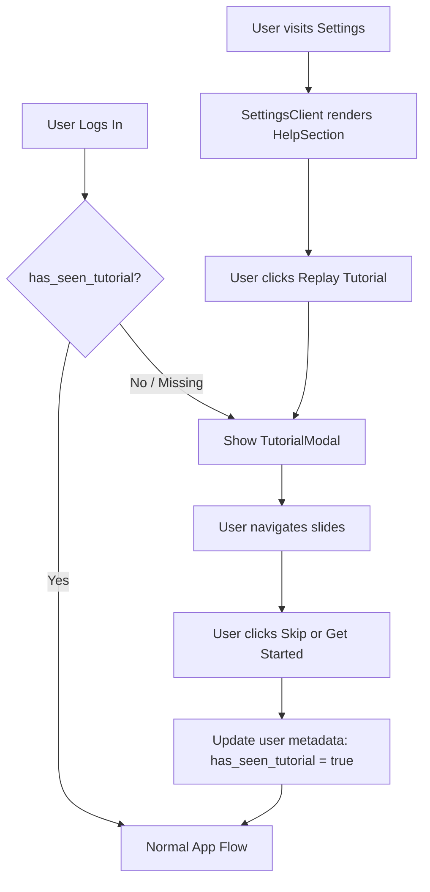

# Design Document

## Overview

The onboarding tutorial feature consists of two parts: a first-login modal walkthrough and a Help & Getting Started section in Settings. The modal is a client-side overlay component that reads tutorial state from Supabase user metadata. The Settings section adds a new card with a replay button and accordion FAQ below the existing Account card.

## Architecture



### Key decisions

- **No new DB table.** Tutorial state is stored in Supabase user metadata (`user.user_metadata.has_seen_tutorial`). This avoids an extra round-trip query and keeps the feature self-contained.
- **Client-side only.** The modal is rendered client-side after auth. There is no server-side logic for tutorial state beyond the metadata flag.
- **No external library.** The slide modal and accordion are built with plain React state and Tailwind CSS. This keeps the bundle small and avoids adding a dependency for a simple UI pattern.
- **Shared modal component.** `TutorialModal` is reusable - it accepts an `onClose` callback so it works identically whether triggered on first login or replayed from Settings.

## Components and Interfaces

### TutorialModal (`components/TutorialModal.tsx`)

A full-screen overlay modal rendered on the client. Manages its own slide index state.

```ts
interface TutorialModalProps {
  onClose: () => void;
}
```

Internal state:
- `currentSlide: number` - index of the active slide (0-4)

Behavior:
- Renders a dark semi-transparent backdrop that blocks page interaction
- Renders a centered card with: icon, title, description, progress dots, navigation buttons
- "Skip" is visible on slides 0-3; "Next" advances the slide
- On slide 4, "Next" is replaced by "Get Started" which calls `onClose`
- "Skip" on any slide calls `onClose`

### TutorialSlide data

Defined as a static array inside `TutorialModal`:

```ts
const slides = [
  {
    id: 'welcome',
    color: 'indigo',
    title: 'Welcome to Shift',
    description: 'Shift is your all-in-one coaching management tool. This quick tour will show you the key features so you can hit the ground running.',
  },
  {
    id: 'calendar',
    color: 'indigo',
    title: 'Calendar',
    description: 'Your main workspace. Schedule lessons, add time blocks, and get a clear view of your week at a glance.',
  },
  {
    id: 'clients',
    color: 'violet',
    title: 'Clients',
    description: 'Build and manage your roster. Add clients, view their lesson history, and track their outstanding balance.',
  },
  {
    id: 'lesson-types',
    color: 'violet',
    title: 'Lesson Types',
    description: 'Define your services and rates. Create lesson types (e.g. "30-min Private") that you can quickly assign when booking.',
  },
  {
    id: 'financials',
    color: 'emerald',
    title: 'Financials',
    description: 'Stay on top of payments. See your total pending balance and track which clients still owe you.',
  },
]
```

### useTutorial hook (`hooks/useTutorial.ts`)

Encapsulates all tutorial state logic so components stay clean.

```ts
interface UseTutorialReturn {
  showTutorial: boolean;
  openTutorial: () => void;
  closeTutorial: () => void;
}
```

Behavior:
- On mount, reads `user.user_metadata.has_seen_tutorial` via Supabase client
- If flag is false/missing, sets `showTutorial = true`
- `closeTutorial` calls `supabase.auth.updateUser({ data: { has_seen_tutorial: true } })` then sets `showTutorial = false`
- `openTutorial` sets `showTutorial = true` without changing the metadata flag (used for replay)

### CalendarPageClient (modified)

The calendar is the first page authenticated users land on. The `useTutorial` hook is added here so the modal appears immediately after first login.

```tsx
// Inside CalendarPageClient
const { showTutorial, closeTutorial } = useTutorial();

return (
  <>
    {showTutorial && <TutorialModal onClose={closeTutorial} />}
    {/* existing calendar content */}
  </>
);
```

### SettingsClient (modified)

A new "Help & Getting Started" card is added below the existing Account card. It contains:
1. A "Replay Tutorial" button that opens `TutorialModal`
2. An `AccordionFAQ` component

```tsx
// Inside SettingsClient - adds local state for tutorial replay
const [showTutorial, setShowTutorial] = useState(false);
```

### AccordionFAQ (`components/AccordionFAQ.tsx`)

A self-contained accordion component. Only one item open at a time.

```ts
interface FAQItem {
  id: string;
  title: string;
  content: string;
}

interface AccordionFAQProps {
  items: FAQItem[];
}
```

Internal state:
- `openItem: string | null` - id of the currently open item

FAQ items content:
```ts
const faqItems = [
  {
    id: 'calendar',
    title: 'Calendar',
    content: 'The Calendar is your main workspace. Tap any time slot to book a lesson or add a time block. Lessons appear color-coded and you can tap them to view details, edit, or mark payment.',
  },
  {
    id: 'dashboard',
    title: 'Dashboard',
    content: 'The Dashboard gives you a snapshot of your business. See how many active clients you have, how many lesson types are set up, and your current pending balance at a glance.',
  },
  {
    id: 'clients',
    title: 'Clients',
    content: 'Clients is your roster. Add a new client with their name and contact info, then view their full lesson history and any outstanding balance from their profile page.',
  },
  {
    id: 'lesson-types',
    title: 'Lesson Types',
    content: 'Lesson Types define your services. Create types like "60-min Private" or "Group Session" with a default rate, then select them when booking so pricing fills in automatically.',
  },
  {
    id: 'financials',
    title: 'Financials',
    content: 'Financials tracks what you are owed. See a breakdown of pending payments across all clients and mark lessons as paid once you collect.',
  },
]
```

## Data Models

No new database tables or columns. The only data change is writing to the existing Supabase `auth.users` user metadata object:

```ts
// Written on tutorial dismissal
await supabase.auth.updateUser({
  data: { has_seen_tutorial: true }
});

// Read on mount
const { data: { user } } = await supabase.auth.getUser();
const hasSeen = user?.user_metadata?.has_seen_tutorial === true;
```

## Visual Design

### TutorialModal layout

```
┌─────────────────────────────────────┐
│  [dark backdrop, blocks interaction]│
│                                     │
│   ┌─────────────────────────────┐   │
│   │   [colored icon circle]     │   │
│   │   Title                     │   │
│   │   Description (1-2 lines)   │   │
│   │                             │   │
│   │   ● ○ ○ ○ ○  (dots)        │   │
│   │                             │   │
│   │   [Skip]        [Next →]    │   │
│   └─────────────────────────────┘   │
│                                     │
└─────────────────────────────────────┘
```

- Card: white background, rounded-2xl, shadow-xl, max-w-sm, centered vertically and horizontally
- Icon circle: 64px, colored bg matching slide theme (indigo/violet/emerald)
- Progress dots: filled = current/past, outline = future
- Buttons: Skip is ghost/text style, Next/Get Started is filled indigo primary button
- Backdrop: `bg-black/60` with `backdrop-blur-sm`

### Settings Help section layout

```
┌─────────────────────────────────────┐
│  Help & Getting Started             │
│                                     │
│  [Replay Tutorial button]           │
│                                     │
│  ▼ Calendar                         │
│    Explanation text...              │
│                                     │
│  ▶ Dashboard                        │
│  ▶ Clients                          │
│  ▶ Lesson Types                     │
│  ▶ Financials                       │
└─────────────────────────────────────┘
```

## Error Handling

- If `supabase.auth.updateUser` fails when saving the tutorial flag, the modal still closes. The user will see the tutorial again on next login, which is acceptable behavior.
- If `supabase.auth.getUser` fails on mount in `useTutorial`, default to `showTutorial = false` to avoid blocking the user.

## Testing Strategy

- Verify modal appears when `has_seen_tutorial` is missing from user metadata
- Verify modal does not appear when `has_seen_tutorial` is true
- Verify slide navigation (Next, Skip, Get Started) works correctly
- Verify progress dots update as slides advance
- Verify `updateUser` is called with `has_seen_tutorial: true` on close
- Verify "Replay Tutorial" in Settings opens the modal
- Verify accordion only allows one item open at a time
