# Shift Application - Architecture Diagrams

**Date:** November 21, 2025
**Purpose:** Visual representation of complete application architecture
**For:** Technical interviews, documentation, and onboarding

---

## Table of Contents
1. [High-Level System Architecture](#1-high-level-system-architecture)
2. [Detailed Application Architecture](#2-detailed-application-architecture)
3. [Authentication Flow](#3-authentication-flow)
4. [Payment Flow (Stripe Integration)](#4-payment-flow-stripe-integration)
5. [Data Flow - Add Client](#5-data-flow---add-client)
6. [Database Schema & Relationships](#6-database-schema--relationships)
7. [Technology Stack](#7-technology-stack)
8. [Deployment Architecture](#8-deployment-architecture)

---

## 1. High-Level System Architecture


---

## 2. Detailed Application Architecture

```mermaid
graph TB
    subgraph "Browser - Client Side"
        direction TB
        LP[Landing Page<br/>Marketing]
        LG[Login/Signup<br/>Authentication]
        DASH[Dashboard<br/>Overview]
        CLI[Clients Pages<br/>Roster Management]
        CAL[Calendar<br/>Lesson Scheduling]

        subgraph "Reusable Components"
            CF[ClientForm]
            BLF[BookLessonForm]
            CALW[Calendar Widget]
            SB[SubscribeButton]
        end
    end

    subgraph "Next.js Server - Vercel"
        direction TB

        subgraph "Middleware Layer"
            MW[middleware.ts<br/>Session Refresh]
        end

        subgraph "Server Components"
            DASHP[dashboard/page.tsx]
            CLIP[clients/page.tsx]
            CALP[calendar/page.tsx]
        end

        subgraph "Server Actions"
            CA[client-actions.ts<br/>CRUD Clients]
            LA[lesson-actions.ts<br/>Manage Lessons]
            STA[stripe-actions.ts<br/>Subscriptions]
        end

        subgraph "API Routes"
            WH[/api/webhooks/stripe<br/>Stripe Events]
        end
    end

    subgraph "Supabase - Backend Services"
        direction TB

        subgraph "Authentication"
            SBAUTH[Supabase Auth API<br/>Email/Password]
        end

        subgraph "Database - PostgreSQL"
            T1[(auth.users)]
            T2[(profiles)]
            T3[(clients)]
            T4[(lessons)]
            T5[(invoices)]
            T6[(invoice_line_items)]
        end

        subgraph "Security"
            RLS[Row Level Security<br/>Policies]
        end
    end

    subgraph "Stripe"
        CHECKOUT[Checkout Sessions<br/>Hosted Payment]
        PORTAL[Customer Portal<br/>Manage Subscription]
        WHSRV[Webhook Server<br/>Events]
    end

    %% User Interactions
    LP -->|Navigate| LG
    LG -->|Submit| SBAUTH
    SBAUTH -->|Session Cookie| DASH
    DASH -->|View| CLI
    CLI -->|Add Client| CF
    CF -->|Submit| CA

    %% Server Flow
    MW -->|Check Auth| SBAUTH
    DASHP -->|Fetch Data| CA
    CLIP -->|Fetch Data| CA
    CA -->|Query| T3
    CA -->|Filter| RLS

    %% Subscription Flow
    SB -->|Create Session| STA
    STA -->|API Call| CHECKOUT
    CHECKOUT -->|Redirect| DASH
    WHSRV -->|POST Event| WH
    WH -->|Update Status| T2

    %% Database Relationships
    T1 -.->|1:1| T2
    T2 -.->|1:many| T3
    T3 -.->|1:many| T4
    T3 -.->|1:many| T5
    T5 -.->|1:many| T6
    T4 -.->|1:1| T6

    style SBAUTH fill:#3ECF8E
    style CHECKOUT fill:#635BFF
    style RLS fill:#E74C3C
    style MW fill:#F39C12
```

---

## 3. Authentication Flow


---

## 4. Payment Flow (Stripe Integration)


---

## 5. Data Flow - Add Client


---

## 6. Database Schema & Relationships

```mermaid
erDiagram
    AUTH_USERS ||--|| PROFILES : "1:1"
    PROFILES ||--o{ CLIENTS : "1:many (coach has many clients)"
    PROFILES ||--o{ LESSONS : "1:many (coach has many lessons)"
    PROFILES ||--o{ INVOICES : "1:many (coach has many invoices)"
    CLIENTS ||--o{ LESSONS : "1:many (client has many lessons)"
    CLIENTS ||--o{ INVOICES : "1:many (client has many invoices)"
    INVOICES ||--o{ INVOICE_LINE_ITEMS : "1:many (invoice has many line items)"
    LESSONS ||--|| INVOICE_LINE_ITEMS : "1:1 (lesson billed once)"

    AUTH_USERS {
        uuid id PK "User ID"
        varchar email UK "Email address"
        varchar encrypted_password "Bcrypt hash"
        timestamp email_confirmed_at "Email verification"
        timestamp created_at "Account creation"
        timestamp last_sign_in_at "Last login"
    }

    PROFILES {
        uuid id PK,FK "References auth.users.id"
        varchar email "Cached email"
        varchar stripe_customer_id "Stripe customer (cus_...)"
        varchar subscription_id "Stripe subscription (sub_...)"
        varchar subscription_status "trial|active|canceled|past_due"
        timestamp trial_ends_at "Trial expiration (NULL if subscribed)"
        varchar venmo_link "Venmo profile URL"
        varchar zelle_link "Zelle email/phone"
        varchar preferred_payment_method "venmo|zelle"
        timestamp created_at "Profile creation"
        timestamp updated_at "Last update"
    }

    CLIENTS {
        uuid id PK "Client ID"
        uuid coach_id FK "References auth.users.id"
        varchar athlete_name "Skater name"
        varchar parent_email "Parent email (invoices)"
        varchar parent_phone "Parent phone (SMS)"
        numeric hourly_rate "Coach rate ($75.00)"
        text notes "Private coach notes"
        varchar status "active|archived (soft delete)"
        timestamp created_at "Client added date"
        timestamp updated_at "Last update"
    }

    LESSONS {
        uuid id PK "Lesson ID"
        uuid coach_id FK "References auth.users.id"
        uuid client_id FK "References clients.id"
        timestamp scheduled_at "Lesson date/time"
        integer duration_minutes "Length (30,45,60,90)"
        varchar status "scheduled|completed|canceled|no_show"
        text notes "Lesson notes"
        timestamp created_at "Scheduled date"
        timestamp updated_at "Last update"
    }

    INVOICES {
        uuid id PK "Invoice ID"
        uuid coach_id FK "References auth.users.id"
        uuid client_id FK "References clients.id"
        varchar invoice_number UK "INV-2025-001"
        numeric total_amount "Total ($300.00)"
        varchar status "draft|sent|paid|overdue"
        text payment_link "Venmo/Zelle deep link"
        timestamp sent_at "Email sent date"
        timestamp paid_at "Payment received date"
        timestamp due_at "Due date"
        timestamp created_at "Invoice created"
        timestamp updated_at "Last update"
    }

    INVOICE_LINE_ITEMS {
        uuid id PK "Line item ID"
        uuid invoice_id FK "References invoices.id"
        uuid lesson_id FK "References lessons.id (nullable)"
        text description "1-hour lesson on Nov 15"
        numeric quantity "Usually 1"
        numeric unit_price "Hourly rate ($75.00)"
        numeric total_price "quantity × unit_price"
        timestamp created_at "Line item added"
    }
```



---

## 7. Technology Stack


---

## 8. Deployment Architecture


---

## Comprehensive System Overview


---

## Key Architectural Decisions

### 1. Server-First Architecture
**Decision:** Use Server Components by default, Client Components only when needed

**Reasoning:**
- Better performance (less JavaScript sent to browser)
- Improved SEO (fully rendered HTML)
- Enhanced security (sensitive logic on server)
- Cost savings (less client processing)

**Trade-offs:**
- Steeper learning curve for developers
- Some interactivity requires client components
- More complex state management

---

### 2. Server Actions vs REST API
**Decision:** Use Server Actions for all mutations, minimal API routes

**Reasoning:**
- Less boilerplate code
- Type-safe across client/server boundary
- Automatic serialization/deserialization
- Better developer experience

**Trade-offs:**
- Vendor lock-in (Next.js specific)
- Cannot call from mobile apps (future consideration)
- Less familiar to traditional backend developers

---

### 3. Supabase for Database + Auth
**Decision:** Use Supabase instead of separate database and auth providers

**Reasoning:**
- Single service for multiple needs
- Built-in Row Level Security
- Real-time capabilities (future use)
- PostgreSQL (battle-tested, scalable)
- Free tier for early stage

**Trade-offs:**
- Vendor lock-in (migration effort if needed)
- Less control over infrastructure
- Must trust third-party with data

---

### 4. Serverless Deployment (Vercel)
**Decision:** Deploy to Vercel serverless instead of traditional servers

**Reasoning:**
- Auto-scaling (handle traffic spikes)
- Pay per use (cost-effective at low scale)
- Zero DevOps (focus on product)
- Global edge network (fast worldwide)

**Trade-offs:**
- Cold starts (50-200ms delay after idle)
- Vendor lock-in
- Limited control over server environment
- Cost scales with usage

---

### 5. Stripe for Coach Subscriptions Only
**Decision:** Use Stripe for coach billing, P2P links for client payments

**Reasoning:**
- PCI compliance handled by Stripe
- Robust subscription management
- No transaction fees on P2P payments
- Coaches keep 100% of lesson revenue

**Trade-offs:**
- Two payment systems to manage
- Manual reconciliation for client payments
- No automated payment tracking for lessons

---

## Interview Talking Points

### System Design Strengths

1. **Scalability:** Serverless architecture auto-scales from 1 to 10,000 users without code changes

2. **Security:** Three layers of security (client validation, server checks, database RLS)

3. **Performance:** Server-side rendering + edge CDN = <100ms page loads globally

4. **Cost Efficiency:** Pay-per-use model keeps costs low during growth phase

5. **Developer Velocity:** Server Actions reduce boilerplate by ~50% vs traditional REST APIs

6. **Type Safety:** TypeScript across frontend/backend catches bugs at compile time

7. **Separation of Concerns:** Clear layers (presentation, business logic, data access)

8. **Database Security:** Row Level Security enforced at database level (cannot be bypassed)

### Potential Improvements

1. **Caching Layer:** Add Redis for frequently accessed data (subscription status, client lists)

2. **Database Replication:** Add read replicas for better read performance

3. **Monitoring:** Implement Sentry for error tracking, Vercel Analytics for performance

4. **Feature Flags:** Use LaunchDarkly or Vercel Edge Config for gradual rollouts

5. **API Layer:** Add REST API for future mobile app (in addition to Server Actions)

6. **Background Jobs:** Implement queue system for email sending, invoice generation

7. **Search:** Add full-text search with Algolia or Elasticsearch for large client rosters

8. **Offline Support:** Implement service workers for offline client list viewing

---

**Document Last Updated:** November 21, 2025
**Mermaid Version:** Compatible with GitHub, GitLab, and Mermaid Live Editor
**Usage:** Copy any diagram into Mermaid Live Editor (https://mermaid.live) to edit or export as PNG/SVG
