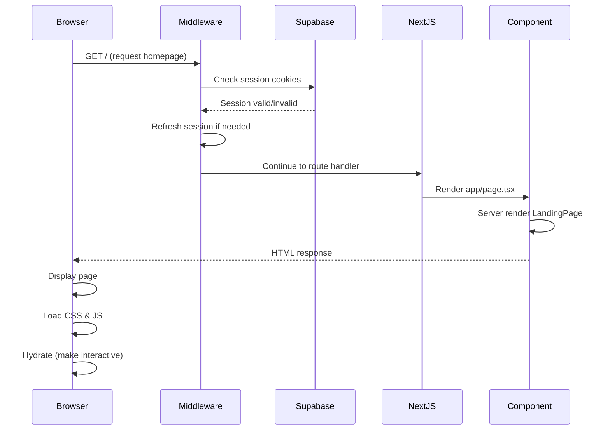
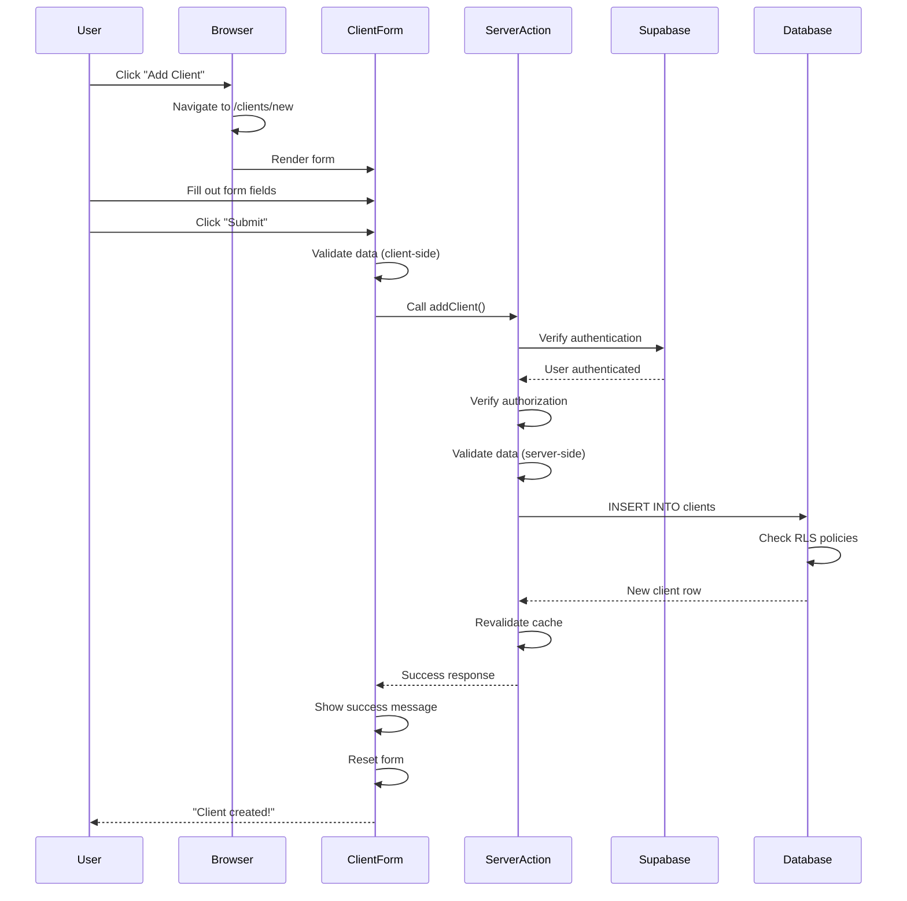
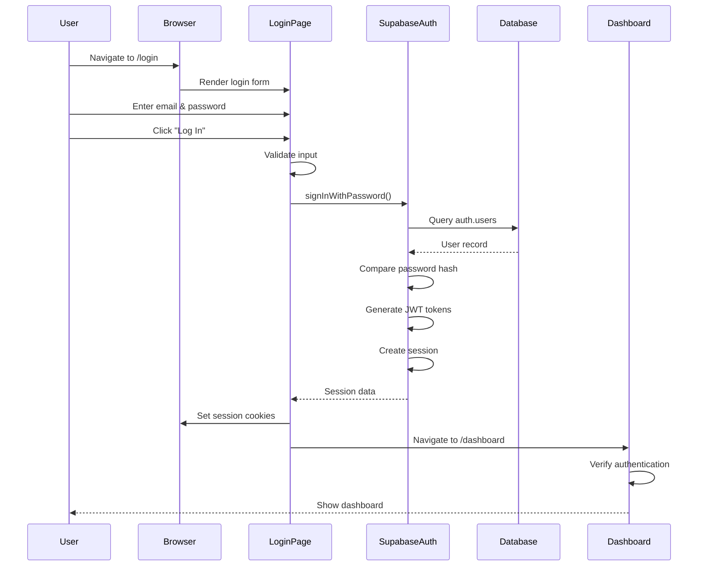
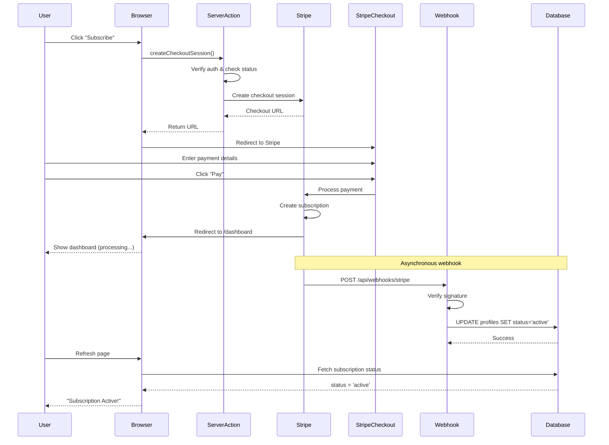
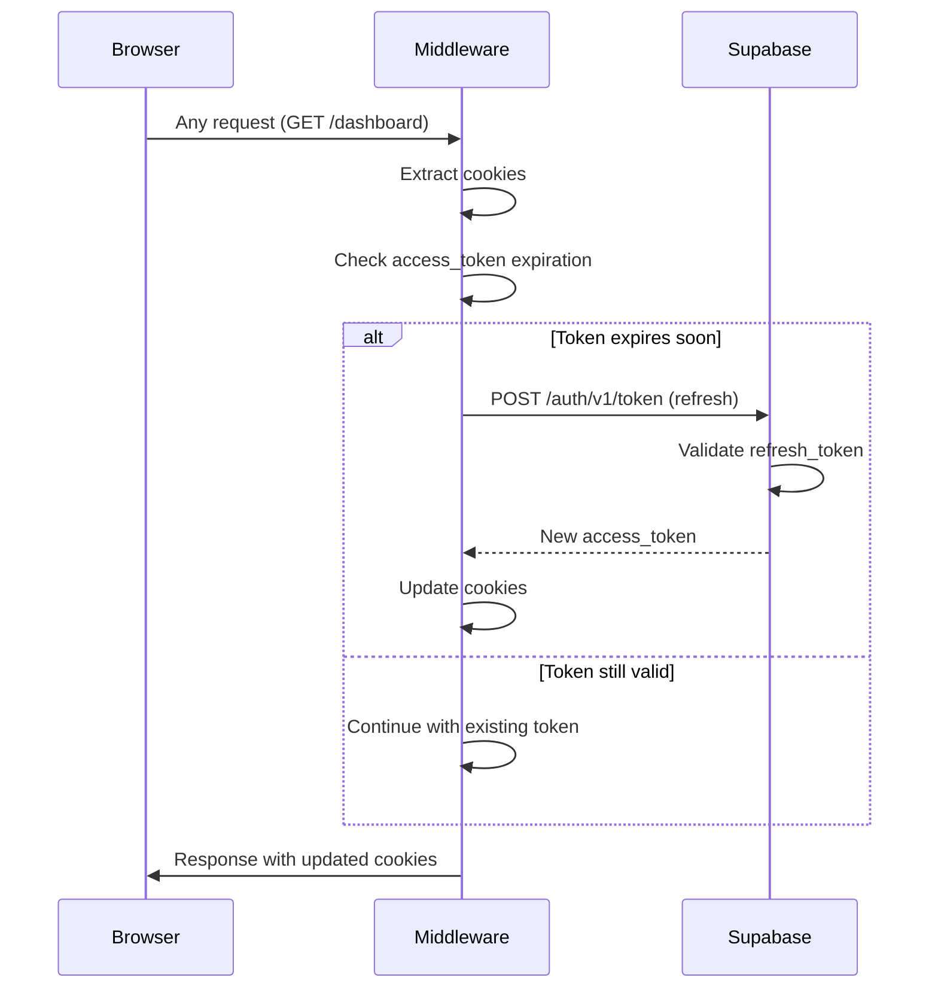
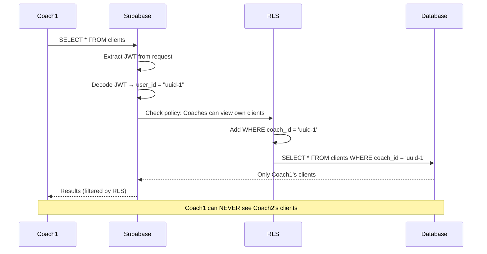

# Data Flow Analysis: Shift Application

**Date:** November 21, 2025
**Purpose:** Trace complete data flows through the Shift application
**For:** Beginner engineers on the fast track to world-class development

---

## Table of Contents
1. [Initial App Load Flow](#1-initial-app-load-flow)
2. [Main User Actions](#2-main-user-actions)
3. [Authentication Flow](#3-authentication-flow)
4. [Payment Processing Flow](#4-payment-processing-flow)
5. [Database Schema & Data Storage](#5-database-schema--data-storage)
6. [Visual Flow Diagrams](#6-visual-flow-diagrams)
7. [Common Patterns Explained](#7-common-patterns-explained)

---

## 1. Initial App Load Flow

### What Happens When a User First Visits the App?

Let's trace **every single step** from the moment someone types your URL into their browser until they see content on screen.

---

### Step-by-Step Flow

#### Step 1: Browser Request
```
User types: https://yourapp.com/
Browser sends HTTP GET request to your server
```

**What happens:** The browser asks your web server "Give me the homepage"

---

#### Step 2: Next.js Middleware Intercepts
**File:** [middleware.ts:8-10](middleware.ts#L8-L10)
```typescript
export async function middleware(request: NextRequest) {
  return await updateSession(request);
}
```

**What happens:** Before ANYTHING else, this middleware function runs

**File:** [lib/supabase/middleware.ts:10-44](lib/supabase/middleware.ts#L10-L44)
```typescript
export async function updateSession(request: NextRequest) {
  // 1. Create a Supabase client with cookie access
  const supabase = createServerClient(...)

  // 2. Check if there's a session cookie
  // 3. If session exists, refresh it (keep user logged in)
  const { data: { user } } = await supabase.auth.getUser();

  // 4. Return response with updated cookies
  return supabaseResponse;
}
```

**What happens:**
1. Middleware checks if user has a session cookie (logged in previously?)
2. If session exists, refreshes it so it doesn't expire
3. If session doesn't exist, continues without authentication
4. Updates cookies in the response

**Think of it like:** A security checkpoint that checks your ID badge every time you enter a building and renews it if it's about to expire.

---

#### Step 3: Route to Correct Page
Next.js looks at the URL and routes to the appropriate page file:

**URL:** `/` → **File:** [app/page.tsx](app/page.tsx)

```typescript
// app/page.tsx:3-5
export default function Home() {
  return <LandingPage />;
}
```

**What happens:** The root page (homepage) simply renders the LandingPage component

---

#### Step 4: Server Component Renders
**File:** [components/LandingPage.tsx](components/LandingPage.tsx)

```typescript
// This is a Client Component ("use client")
// It renders the marketing landing page with:
// - Hero section
// - Features
// - Call-to-action buttons (Login/Signup)
```

**What happens:**
1. Next.js executes the LandingPage component on the **server first**
2. Generates HTML with all the content
3. Sends HTML to browser
4. Browser displays the page instantly (fast!)
5. React "hydrates" the page (makes it interactive)

**Think of it like:** A restaurant that pre-cooks your meal (server rendering), delivers it hot (HTML), then you can customize it (client-side interactivity)

---

#### Step 5: CSS Loads
**File:** [app/globals.css](app/globals.css)

The browser loads global CSS styles:
- Tailwind CSS utilities
- Custom animations
- Dark mode styles

**What happens:** Page gets styled according to Tailwind classes

---

#### Step 6: Client-Side JavaScript Hydrates
React takes over in the browser:
- Attaches event listeners (button clicks, form submissions)
- Makes the page interactive
- Enables navigation without full page reloads

**What happens:** Page becomes fully interactive

---

### Complete Initial Load Timeline

```
0ms:   User types URL
10ms:  Browser sends HTTP GET request
20ms:  Request hits Next.js server
25ms:  Middleware intercepts → checks session → refreshes cookies
30ms:  Routes to app/page.tsx
35ms:  Server renders LandingPage component
40ms:  HTML sent to browser
50ms:  Browser displays HTML (user sees content!)
60ms:  CSS loads and applies
70ms:  JavaScript loads
80ms:  React hydrates (page becomes interactive)
```

**Total time:** ~80ms for initial meaningful paint

---

### Files Involved in Initial Load

1. **[middleware.ts](middleware.ts)** - Session refresh
2. **[lib/supabase/middleware.ts](lib/supabase/middleware.ts)** - Supabase session logic
3. **[app/layout.tsx](app/layout.tsx)** - Root layout (HTML structure, fonts)
4. **[app/page.tsx](app/page.tsx)** - Homepage route
5. **[components/LandingPage.tsx](components/LandingPage.tsx)** - Marketing content
6. **[app/globals.css](app/globals.css)** - Global styles

---

## 2. Main User Actions

Let's trace the **three most important user actions** in your app with complete data flows.

---

## Action 1: Adding a New Client

This is a CORE feature of your app. Let's trace every byte of data from UI click to database and back.

---

### Step-by-Step Flow: Add Client

#### Step 1: User Navigates to "Add Client" Page

**User clicks:** "Add Client" button on dashboard
**Navigation happens:** Browser goes to `/clients/new`

**File:** [app/clients/new/page.tsx](app/clients/new/page.tsx)

```typescript
// Server Component (runs on server first)
export default async function NewClientPage() {
  const supabase = await createClient();

  // 1. Verify user is authenticated
  const { data: { user }, error } = await supabase.auth.getUser();

  // 2. If not authenticated, redirect to login
  if (error || !user) {
    redirect('/login');
  }

  // 3. Render the client component with user ID
  return <NewClientPageClient coachId={user.id} />;
}
```

**What happens:**
1. Server checks if user is logged in (authentication check)
2. If not logged in, redirects to `/login`
3. If logged in, passes coach's user ID to the client component
4. Renders the form

---

#### Step 2: User Fills Out Form

**File:** [components/ClientForm.tsx](components/ClientForm.tsx)

```typescript
// Client Component (runs in browser)
export default function ClientForm({ coachId, client, onSuccess, onCancel }) {
  // React state for form fields
  const [athleteName, setAthleteName] = useState('');
  const [parentEmail, setParentEmail] = useState('');
  const [parentPhone, setParentPhone] = useState('');
  const [hourlyRate, setHourlyRate] = useState('');
  const [notes, setNotes] = useState('');
  const [isLoading, setIsLoading] = useState(false);
  const [error, setError] = useState(null);

  // ... form JSX with inputs bound to state
}
```

**What happens:**
1. User types in "Athlete Name" field → `setAthleteName()` updates state
2. User types in "Parent Email" → `setParentEmail()` updates state
3. User types in "Parent Phone" → `setParentPhone()` updates state
4. User types in "Hourly Rate" → `setHourlyRate()` updates state
5. User types in "Notes" → `setNotes()` updates state

**Data in memory (browser):**
```javascript
{
  athleteName: "Sarah Johnson",
  parentEmail: "mom@example.com",
  parentPhone: "(555) 123-4567",
  hourlyRate: "75.00",
  notes: "Working on single axel, prefers morning lessons"
}
```

---

#### Step 3: User Submits Form

**File:** [components/ClientForm.tsx:39-114](components/ClientForm.tsx#L39-L114)

```typescript
const handleSubmit = async (e: FormEvent) => {
  e.preventDefault(); // Prevent page reload
  setError(null);
  setIsLoading(true); // Show loading spinner

  // STEP 3A: CLIENT-SIDE VALIDATION
  const hourly = parseFloat(hourlyRate || '0');
  const validationErrors = validateClientData({
    athlete_name: athleteName.trim(),
    parent_email: parentEmail.trim().toLowerCase(),
    parent_phone: parentPhone.trim(),
    hourly_rate: hourly,
  });

  if (validationErrors.length > 0) {
    setError(validationErrors[0].message);
    setIsLoading(false);
    return; // Stop here if validation fails
  }

  // STEP 3B: CALL SERVER ACTION
  const result = await addClient({
    coach_id: coachId,
    athlete_name: athleteName.trim(),
    parent_email: parentEmail.trim().toLowerCase(),
    parent_phone: parentPhone.trim(),
    hourly_rate: parseFloat(hourlyRate),
    notes: notes.trim() || undefined,
  });

  // STEP 3C: HANDLE RESPONSE
  if (!result.success) {
    setError(result.error);
    setIsLoading(false);
    return;
  }

  // Success! Show success message
  setSuccessMessage("Client created successfully!");
  // Reset form
  setAthleteName('');
  setParentEmail('');
  // ...
};
```

**What happens:**
1. **Prevent default:** Stops browser from doing a full page reload
2. **Validate on client:** Check data before sending to server (fast feedback)
3. **Call server action:** Send data to backend
4. **Wait for response:** Loading spinner shows
5. **Handle result:** Show success or error message

---

#### Step 4: Server Action Processes Request

**File:** [app/actions/client-actions.ts:14-101](app/actions/client-actions.ts#L14-L101)

```typescript
'use server'; // This tells Next.js this code ONLY runs on server

export async function addClient(formData: {
  coach_id: string;
  athlete_name: string;
  parent_email: string;
  parent_phone: string;
  hourly_rate: number;
  notes?: string;
}) {
  // STEP 4A: CREATE SUPABASE CLIENT
  const supabase = await createClient();

  // STEP 4B: VERIFY AUTHENTICATION (security check #1)
  const { data: { user }, error: authError } = await supabase.auth.getUser();

  if (authError || !user) {
    return {
      success: false,
      error: 'You must be logged in to create a client.',
    };
  }

  // STEP 4C: VERIFY OWNERSHIP (security check #2)
  // Make sure coach_id matches the logged-in user
  if (formData.coach_id !== user.id) {
    return {
      success: false,
      error: 'Unauthorized: Cannot create clients for other coaches.',
    };
  }

  // STEP 4D: SERVER-SIDE VALIDATION (security check #3)
  const validationErrors = validateClientData({
    athlete_name: formData.athlete_name,
    parent_email: formData.parent_email,
    parent_phone: formData.parent_phone,
    hourly_rate: formData.hourly_rate,
  });

  if (validationErrors.length > 0) {
    return {
      success: false,
      error: validationErrors[0].message,
    };
  }

  // STEP 4E: INSERT INTO DATABASE
  const { data, error } = await supabase
    .from('clients')
    .insert({
      coach_id: formData.coach_id,
      athlete_name: formData.athlete_name,
      parent_email: formData.parent_email,
      parent_phone: formData.parent_phone,
      hourly_rate: formData.hourly_rate,
      notes: formData.notes || null,
      status: 'active',
    })
    .select()
    .single();

  if (error) {
    console.error('Database error:', error);
    return {
      success: false,
      error: `Failed to create client: ${error.message}`,
    };
  }

  // STEP 4F: REVALIDATE CACHE
  revalidatePath('/dashboard/clients');
  revalidatePath('/clients');

  // STEP 4G: RETURN SUCCESS
  return {
    success: true,
    data,
  };
}
```

**What happens:**
1. **Authentication:** Verify user is logged in
2. **Authorization:** Verify user owns this data
3. **Validation:** Validate data again (never trust client)
4. **Database Insert:** Save to PostgreSQL via Supabase
5. **Cache Invalidation:** Tell Next.js to refresh the clients list
6. **Return result:** Send success/error back to client

---

#### Step 5: Database Processes Insert

**Database:** Supabase PostgreSQL

```sql
-- Supabase executes this SQL:
INSERT INTO clients (
  coach_id,
  athlete_name,
  parent_email,
  parent_phone,
  hourly_rate,
  notes,
  status,
  created_at,
  updated_at
) VALUES (
  'user-uuid-here',
  'Sarah Johnson',
  'mom@example.com',
  '(555) 123-4567',
  75.00,
  'Working on single axel, prefers morning lessons',
  'active',
  NOW(),
  NOW()
) RETURNING *;
```

**Row Level Security (RLS) Policy:**
```sql
-- This policy runs automatically (defined in Supabase)
-- Only allows coaches to insert clients where coach_id = their own user ID
CREATE POLICY "Coaches can insert own clients"
ON clients FOR INSERT
TO authenticated
WITH CHECK (auth.uid() = coach_id);
```

**What happens:**
1. Database receives INSERT command
2. RLS policy checks: "Does this user own this data?"
3. If yes, inserts row
4. If no, rejects with permission error
5. Returns the new row with auto-generated ID and timestamps

**New row in database:**
```json
{
  "id": "client-uuid-generated-here",
  "coach_id": "user-uuid-here",
  "athlete_name": "Sarah Johnson",
  "parent_email": "mom@example.com",
  "parent_phone": "(555) 123-4567",
  "hourly_rate": 75.00,
  "notes": "Working on single axel, prefers morning lessons",
  "status": "active",
  "created_at": "2025-11-21T10:30:00Z",
  "updated_at": "2025-11-21T10:30:00Z"
}
```

---

#### Step 6: Response Travels Back to Browser

**Path:** Database → Server Action → Client Component

**File:** [components/ClientForm.tsx:90-107](components/ClientForm.tsx#L90-L107)

```typescript
// Success!
setSuccessMessage("Client created successfully!");

// Reset form
setAthleteName('');
setParentEmail('');
setParentPhone('');
setHourlyRate('');
setNotes('');

// Call success callback after delay
setTimeout(() => {
  if (onSuccess) {
    onSuccess(); // Could navigate to client list or dashboard
  }
}, 1500);
```

**What happens:**
1. Green success message shows: "Client created successfully!"
2. Form fields clear out
3. After 1.5 seconds, page redirects or refreshes
4. New client appears in the client list

---

### Complete Add Client Timeline

```
0ms:    User clicks "Submit" button
5ms:    React prevents default form submission
10ms:   Client-side validation runs
15ms:   Server action called (network request starts)
200ms:  Request arrives at server
205ms:  Server creates Supabase client
210ms:  Server verifies authentication
215ms:  Server verifies authorization
220ms:  Server validates data
225ms:  Server sends INSERT to database
250ms:  Database checks RLS policies
255ms:  Database inserts row
260ms:  Database returns new row
265ms:  Server receives database response
270ms:  Server invalidates Next.js cache
275ms:  Server returns success response (network response starts)
475ms:  Response arrives at browser
480ms:  React updates UI (success message, form reset)
```

**Total time:** ~480ms from click to confirmation

---

### Files Involved in Add Client Flow

1. **[app/clients/new/page.tsx](app/clients/new/page.tsx)** - Route & auth check
2. **[app/clients/new/NewClientPageClient.tsx](app/clients/new/NewClientPageClient.tsx)** - Client wrapper
3. **[components/ClientForm.tsx](components/ClientForm.tsx)** - Form UI & submission
4. **[lib/validation/client-validation.ts](lib/validation/client-validation.ts)** - Validation rules
5. **[app/actions/client-actions.ts](app/actions/client-actions.ts)** - Server action
6. **[lib/supabase/server.ts](lib/supabase/server.ts)** - Database client
7. **Supabase PostgreSQL** - Database storage

---

## Action 2: User Logs In

Let's trace the complete authentication flow.

---

### Step-by-Step Flow: Login

#### Step 1: User Visits Login Page

**URL:** `/login`
**File:** [app/login/page.tsx](app/login/page.tsx)

```typescript
'use client'; // Client Component (needs interactivity)

export default function LoginPage() {
  const [email, setEmail] = useState('');
  const [password, setPassword] = useState('');
  const [isLoading, setIsLoading] = useState(false);
  const [error, setError] = useState(null);

  const router = useRouter();
  const supabase = createClient(); // Browser Supabase client

  // ... render form
}
```

**What happens:**
1. Page renders login form
2. Email and password inputs are controlled by React state
3. Supabase client is created for browser-side auth

---

#### Step 2: User Enters Credentials & Submits

**File:** [app/login/page.tsx:17-68](app/login/page.tsx#L17-L68)

```typescript
const handleLogin = async (e: FormEvent) => {
  e.preventDefault();
  setError(null);
  setIsLoading(true);

  // STEP 2A: CLIENT-SIDE VALIDATION
  if (!email || !password) {
    setError('Email and password are required.');
    setIsLoading(false);
    return;
  }

  const emailRegex = /^[^\s@]+@[^\s@]+\.[^\s@]+$/;
  if (!emailRegex.test(email)) {
    setError('Please enter a valid email address.');
    setIsLoading(false);
    return;
  }

  try {
    // STEP 2B: CALL SUPABASE AUTH API
    const { data, error: signInError } = await supabase.auth.signInWithPassword({
      email,
      password,
    });

    if (signInError) {
      throw signInError;
    }

    if (data?.user) {
      // STEP 2C: REDIRECT TO DASHBOARD
      router.push('/dashboard');
    }
  } catch (err: any) {
    // STEP 2D: HANDLE ERRORS
    if (err.message === 'Invalid login credentials') {
      setError('Invalid email or password. Please try again.');
    } else {
      setError(err.message || 'An error occurred during login.');
    }
    setIsLoading(false);
  }
};
```

**What happens:**
1. **Validate input:** Check email format, ensure fields not empty
2. **Call Supabase:** `supabase.auth.signInWithPassword()`
3. **Supabase verifies:** Checks email/password against database
4. **Supabase creates session:** Generates session tokens
5. **Supabase sets cookies:** Stores session in browser cookies
6. **Redirect:** Navigate to `/dashboard`

---

#### Step 3: Supabase Auth API Processes Login

**What happens on Supabase servers:**

```
1. Receive login request with email/password
2. Query auth.users table for user with that email
3. Compare password hash (bcrypt)
4. If match:
   a. Generate access token (JWT)
   b. Generate refresh token
   c. Create session record
   d. Return tokens + user data
5. If no match:
   a. Return error: "Invalid login credentials"
```

**Supabase returns (on success):**
```json
{
  "user": {
    "id": "user-uuid",
    "email": "coach@example.com",
    "created_at": "2025-11-01T...",
    ...
  },
  "session": {
    "access_token": "eyJhbGciOiJIUzI1NiIsInR5cCI6IkpXVCJ9...",
    "refresh_token": "refresh-token-here",
    "expires_at": 1732276800,
    "token_type": "bearer"
  }
}
```

---

#### Step 4: Session Stored in Cookies

**File:** [lib/supabase/client.ts](lib/supabase/client.ts)

The Supabase browser client automatically:
1. Stores `access_token` in cookie: `sb-access-token`
2. Stores `refresh_token` in cookie: `sb-refresh-token`
3. Sets cookie attributes:
   - `HttpOnly: false` (needs to be readable by JS)
   - `Secure: true` (HTTPS only)
   - `SameSite: Lax` (CSRF protection)

**Browser cookies after login:**
```
sb-access-token=eyJhbGciOiJIUzI1NiIsInR5cCI6IkpXVCJ9...
sb-refresh-token=refresh-token-here
```

---

#### Step 5: Redirect to Dashboard

**File:** [app/dashboard/page.tsx](app/dashboard/page.tsx)

```typescript
export default async function DashboardPage() {
  const supabase = await createClient();

  // STEP 5A: CHECK AUTHENTICATION
  const { data: { user }, error } = await supabase.auth.getUser();

  // STEP 5B: REDIRECT IF NOT AUTHENTICATED
  if (error || !user) {
    redirect('/login');
  }

  // STEP 5C: FETCH SUBSCRIPTION STATUS
  const subscriptionStatus = await checkSubscriptionStatus();

  // STEP 5D: RENDER DASHBOARD
  return (
    <DashboardWrapper>
      <div>Welcome, {user.email}!</div>
      {/* ... dashboard content */}
    </DashboardWrapper>
  );
}
```

**What happens:**
1. Server reads session cookie
2. Verifies session is valid
3. Fetches user data from database
4. Fetches subscription status
5. Renders dashboard with user-specific data

---

### Complete Login Timeline

```
0ms:    User clicks "Log In" button
5ms:    Client-side validation runs
10ms:   Supabase auth API called (network request)
200ms:  Request reaches Supabase servers
205ms:  Supabase queries auth.users table
210ms:  Supabase compares password hash
215ms:  Supabase generates session tokens
220ms:  Supabase returns user + session (network response)
410ms:  Response reaches browser
415ms:  Session stored in cookies
420ms:  Router navigates to /dashboard
425ms:  Middleware intercepts /dashboard request
430ms:  Middleware refreshes session
435ms:  Dashboard page checks authentication
440ms:  Dashboard fetches user data
445ms:  Dashboard renders
```

**Total time:** ~450ms from click to dashboard

---

### Files Involved in Login Flow

1. **[app/login/page.tsx](app/login/page.tsx)** - Login form & auth call
2. **[lib/supabase/client.ts](lib/supabase/client.ts)** - Browser Supabase client
3. **Supabase Auth API** - Authentication service
4. **[middleware.ts](middleware.ts)** - Session refresh on navigation
5. **[lib/supabase/middleware.ts](lib/supabase/middleware.ts)** - Session refresh logic
6. **[app/dashboard/page.tsx](app/dashboard/page.tsx)** - Protected dashboard page
7. **[lib/supabase/server.ts](lib/supabase/server.ts)** - Server Supabase client

---

## Action 3: User Subscribes (Stripe Checkout)

This is the most complex flow because it involves THREE systems: Your app, Stripe, and webhooks.

---

### Step-by-Step Flow: Subscribe

#### Step 1: User Clicks "Subscribe" Button

**File:** [app/dashboard/page.tsx:173](app/dashboard/page.tsx#L173)

```typescript
// Dashboard shows subscription banner
<SubscribeButton priceId={stripePriceId} />
```

**File:** [components/SubscribeButton.tsx](components/SubscribeButton.tsx)

```typescript
'use client';

export default function SubscribeButton({ priceId }: { priceId: string }) {
  const [isLoading, setIsLoading] = useState(false);

  const handleSubscribe = async () => {
    setIsLoading(true);

    // STEP 1A: CALL SERVER ACTION
    const result = await createCheckoutSession(priceId);

    if (!result.success) {
      alert(result.error);
      setIsLoading(false);
      return;
    }

    // STEP 1B: REDIRECT TO STRIPE
    window.location.href = result.sessionUrl;
  };

  return (
    <button onClick={handleSubscribe}>
      Subscribe Now - $10/month
    </button>
  );
}
```

**What happens:**
1. User clicks "Subscribe Now" button
2. Button calls `createCheckoutSession()` server action
3. Waits for response
4. Redirects to Stripe Checkout page

---

#### Step 2: Server Creates Stripe Checkout Session

**File:** [app/actions/stripe-actions.ts:66-200](app/actions/stripe-actions.ts#L66-L200)

```typescript
'use server';

export async function createCheckoutSession(priceId: string) {
  // STEP 2A: VERIFY AUTHENTICATION
  const supabase = await createClient();
  const { data: { user }, error: authError } = await supabase.auth.getUser();

  if (authError || !user) {
    return {
      success: false,
      error: 'You must be logged in to subscribe.',
    };
  }

  // STEP 2B: FETCH USER PROFILE
  const { data: profile, error: profileError } = await supabase
    .from('profiles')
    .select('stripe_customer_id, subscription_status')
    .eq('id', user.id)
    .single();

  // STEP 2C: PREVENT DUPLICATE SUBSCRIPTIONS
  if (profile?.subscription_status === 'active') {
    return {
      success: false,
      error: 'You already have an active subscription.',
    };
  }

  // STEP 2D: CREATE STRIPE CHECKOUT SESSION
  const session = await stripe.checkout.sessions.create({
    customer: profile?.stripe_customer_id || undefined,
    customer_email: profile?.stripe_customer_id ? undefined : user.email,
    client_reference_id: user.id, // Link session to our user
    line_items: [
      {
        price: priceId, // e.g., "price_1ABC123..."
        quantity: 1,
      },
    ],
    mode: 'subscription',
    success_url: `${appUrl}/dashboard?status=success&session_id={CHECKOUT_SESSION_ID}`,
    cancel_url: `${appUrl}/dashboard?status=cancel`,
    allow_promotion_codes: true,
    metadata: {
      user_id: user.id,
      user_email: user.email,
    },
    subscription_data: {
      metadata: {
        user_id: user.id,
      },
    },
  });

  // STEP 2E: RETURN CHECKOUT URL
  return {
    success: true,
    sessionUrl: session.url, // Stripe Checkout URL
    sessionId: session.id,
  };
}
```

**What happens:**
1. **Verify auth:** Ensure user is logged in
2. **Fetch profile:** Check if user already has subscription
3. **Call Stripe API:** Create Checkout Session
4. **Stripe creates session:** Generates unique checkout page
5. **Return URL:** Send Stripe Checkout URL back to client

**Stripe API creates:**
```json
{
  "id": "cs_test_abc123...",
  "url": "https://checkout.stripe.com/c/pay/cs_test_abc123#...",
  "customer": "cus_ABC123",
  "client_reference_id": "user-uuid",
  "line_items": [
    {
      "price": "price_1ABC123",
      "quantity": 1,
      "amount_total": 1000 // $10.00 in cents
    }
  ],
  "mode": "subscription",
  "success_url": "https://yourapp.com/dashboard?status=success",
  "cancel_url": "https://yourapp.com/dashboard?status=cancel"
}
```

---

#### Step 3: User Redirected to Stripe Checkout

**File:** [components/SubscribeButton.tsx](components/SubscribeButton.tsx)

```typescript
// Redirect to Stripe
window.location.href = result.sessionUrl;
```

**What happens:**
1. Browser navigates to `https://checkout.stripe.com/c/pay/cs_test_abc123...`
2. User leaves your website (goes to Stripe's servers)
3. Stripe shows checkout page with:
   - Product: "Individual Coach Plan"
   - Price: $10/month
   - Payment form (credit card inputs)

---

#### Step 4: User Enters Payment on Stripe

**On Stripe's servers:**

```
User sees:
-----------
Individual Coach Plan
$10.00 / month

[Email: coach@example.com]
[Card number: 4242 4242 4242 4242]
[Exp: 12/25]  [CVC: 123]

[Pay $10.00]
```

**What happens:**
1. User enters credit card details
2. Stripe validates card (client-side checks)
3. User clicks "Pay"
4. Stripe processes payment
5. Stripe creates Subscription object in their database
6. Stripe creates Customer object (if new customer)

**Important:** Your app NEVER sees credit card numbers. This is PCI compliance.

---

#### Step 5: Stripe Redirects Back to Your App

**On payment success:**

```
Stripe redirects to:
https://yourapp.com/dashboard?status=success&session_id=cs_test_abc123
```

**File:** [app/dashboard/page.tsx](app/dashboard/page.tsx)

```typescript
export default async function DashboardPage() {
  // ... checks authentication
  // ... fetches subscription status (might still be "trial" at this moment)
  // ... renders dashboard
}
```

**What happens:**
1. User returns to your dashboard
2. URL has `?status=success` (but subscription might not be updated yet!)
3. Dashboard shows "Processing..." or similar message

**Why isn't subscription updated yet?** Because Stripe hasn't sent the webhook yet!

---

#### Step 6: Stripe Sends Webhook (Asynchronously)

**This happens in parallel, usually 1-5 seconds after payment**

**Stripe sends HTTP POST request to:**
```
POST https://yourapp.com/api/webhooks/stripe

Headers:
  stripe-signature: t=timestamp,v1=signature

Body:
{
  "id": "evt_abc123",
  "type": "checkout.session.completed",
  "data": {
    "object": {
      "id": "cs_test_abc123",
      "customer": "cus_ABC123",
      "subscription": "sub_ABC123",
      "client_reference_id": "user-uuid",
      "payment_status": "paid"
    }
  }
}
```

**File:** [app/api/webhooks/stripe/route.ts:70-147](app/api/webhooks/stripe/route.ts#L70-L147)

```typescript
export async function POST(req: Request) {
  const body = await req.text();
  const signature = req.headers.get('stripe-signature');

  // STEP 6A: VERIFY WEBHOOK SIGNATURE (security!)
  const webhookSecret = process.env.STRIPE_WEBHOOK_SECRET;
  let event: Stripe.Event;

  try {
    event = stripe.webhooks.constructEvent(body, signature, webhookSecret);
  } catch (err) {
    console.error('Webhook verification failed:', err);
    return NextResponse.json({ error: 'Invalid signature' }, { status: 400 });
  }

  // STEP 6B: HANDLE EVENT TYPE
  switch (event.type) {
    case 'checkout.session.completed':
      await handleCheckoutSessionCompleted(event.data.object);
      break;
    case 'customer.subscription.updated':
      await handleSubscriptionUpdated(event.data.object);
      break;
    case 'customer.subscription.deleted':
      await handleSubscriptionDeleted(event.data.object);
      break;
    default:
      console.log(`Unhandled event type: ${event.type}`);
  }

  return NextResponse.json({ received: true }, { status: 200 });
}
```

**What happens:**
1. **Verify signature:** Ensure webhook is from Stripe (not a hacker)
2. **Parse event:** Determine event type
3. **Route to handler:** Call appropriate handler function

---

#### Step 7: Update Subscription Status in Database

**File:** [app/api/webhooks/stripe/route.ts:157-192](app/api/webhooks/stripe/route.ts#L157-L192)

```typescript
async function handleCheckoutSessionCompleted(session: Stripe.Checkout.Session) {
  console.log('Processing checkout.session.completed:', session.id);

  // STEP 7A: EXTRACT USER ID
  const userId = session.client_reference_id || session.metadata?.user_id;

  if (!userId) {
    console.error('No user_id found in session');
    return;
  }

  // STEP 7B: EXTRACT STRIPE IDS
  const customerId = session.customer as string;
  const subscriptionId = session.subscription as string;

  // STEP 7C: UPDATE DATABASE (using Service Role - bypasses RLS)
  const { data, error } = await supabaseAdmin
    .from('profiles')
    .update({
      stripe_customer_id: customerId,
      subscription_id: subscriptionId,
      subscription_status: 'active',
      trial_ends_at: null, // Clear trial
      updated_at: new Date().toISOString(),
    })
    .eq('id', userId)
    .select();

  if (error) {
    console.error('Error updating profile:', error);
    throw error;
  }

  console.log(`Successfully activated subscription for user ${userId}`);
}
```

**What happens:**
1. **Extract user ID:** From `client_reference_id` we set earlier
2. **Extract Stripe IDs:** Customer and Subscription IDs
3. **Update database:** Set `subscription_status` to `'active'`
4. **Log success:** Webhook processing complete

**Database update:**
```sql
UPDATE profiles
SET
  stripe_customer_id = 'cus_ABC123',
  subscription_id = 'sub_ABC123',
  subscription_status = 'active',
  trial_ends_at = NULL,
  updated_at = NOW()
WHERE id = 'user-uuid';
```

---

#### Step 8: User Refreshes Dashboard

**User refreshes page or navigates away and back**

**File:** [app/dashboard/page.tsx:38-39](app/dashboard/page.tsx#L38-L39)

```typescript
// Fetch subscription status (NOW it's updated!)
const subscriptionStatus = await checkSubscriptionStatus();
```

**File:** [app/actions/stripe-actions.ts:273-319](app/actions/stripe-actions.ts#L273-L319)

```typescript
export async function checkSubscriptionStatus() {
  const supabase = await createClient();
  const { data: { user } } = await supabase.auth.getUser();

  const { data: profile } = await supabase
    .from('profiles')
    .select('subscription_status, trial_ends_at')
    .eq('id', user.id)
    .single();

  return {
    success: true,
    subscriptionStatus: profile.subscription_status, // Now "active"!
    trialEndsAt: profile.trial_ends_at,
    isTrialExpired: false,
    hasAccess: true,
  };
}
```

**What happens:**
1. Dashboard fetches subscription status
2. Sees `subscription_status: 'active'`
3. Shows green "Subscription Active!" banner
4. Hides trial countdown
5. User has full access

---

### Complete Subscribe Timeline

```
0ms:      User clicks "Subscribe" button
10ms:     Server action called
200ms:    Request reaches server
210ms:    Server verifies authentication
220ms:    Server fetches user profile
230ms:    Server calls Stripe API: create checkout session
450ms:    Stripe API creates session
460ms:    Stripe returns checkout URL
670ms:    Response reaches browser
680ms:    Browser redirects to Stripe
1000ms:   User lands on Stripe Checkout page
...       User enters payment details (30-60 seconds)
60000ms:  User clicks "Pay" on Stripe
60100ms:  Stripe processes payment
60200ms:  Stripe creates subscription
60300ms:  Stripe redirects user back to app
60500ms:  User lands on dashboard (sees "Processing...")
61000ms:  Stripe sends webhook to your API (asynchronous)
61200ms:  Webhook handler verifies signature
61210ms:  Webhook handler updates database
61220ms:  Database updates subscription_status to 'active'
...       User refreshes page
62000ms:  Dashboard fetches subscription status (now "active")
62050ms:  Dashboard renders "Subscription Active!" banner
```

**Total time:** ~60-90 seconds from click to activation (mostly user input time)

---

### Files Involved in Subscribe Flow

1. **[components/SubscribeButton.tsx](components/SubscribeButton.tsx)** - Subscribe button UI
2. **[app/actions/stripe-actions.ts](app/actions/stripe-actions.ts)** - Checkout session creation
3. **Stripe Checkout** - Payment page (external)
4. **[app/api/webhooks/stripe/route.ts](app/api/webhooks/stripe/route.ts)** - Webhook handler
5. **[app/dashboard/page.tsx](app/dashboard/page.tsx)** - Dashboard with status check
6. **Supabase PostgreSQL** - Profile table with subscription_status

---

## 3. Authentication Flow

Let's document the complete authentication system in detail.

---

### Authentication Architecture

**System:** Supabase Auth (built on PostgreSQL + JWT)

**Components:**
1. **Email/Password Authentication** - Traditional login
2. **Session Management** - Cookies + JWT tokens
3. **Row Level Security (RLS)** - Database-level authorization
4. **Middleware** - Session refresh on every request

---

### Where Authentication Happens

#### 1. Signup Flow

**File:** [app/signup/page.tsx:19-93](app/signup/page.tsx#L19-L93)

```typescript
const handleSignUp = async (e: FormEvent) => {
  e.preventDefault();

  // Validation
  if (password !== confirmPassword) {
    setError('Passwords do not match.');
    return;
  }

  if (password.length < 6) {
    setError('Password must be at least 6 characters long.');
    return;
  }

  // Call Supabase Auth API
  const { data, error } = await supabase.auth.signUp({
    email,
    password,
    options: {
      emailRedirectTo: `${window.location.origin}/dashboard`,
    },
  });

  if (error) {
    throw error;
  }

  if (data?.user) {
    // Check if email confirmation required
    if (data.session) {
      // No confirmation needed - redirect immediately
      router.push('/dashboard');
    } else {
      // Confirmation required - show message
      setSuccessMessage('Please check your email to confirm your account.');
    }
  }
};
```

**Supabase creates:**
1. **User record in `auth.users` table:**
```sql
INSERT INTO auth.users (
  id,
  email,
  encrypted_password,
  email_confirmed_at,
  created_at,
  updated_at
) VALUES (
  uuid_generate_v4(),
  'coach@example.com',
  '$2a$10$hashedpasswordhere',
  NOW(), -- or NULL if email confirmation required
  NOW(),
  NOW()
);
```

2. **Profile record in `profiles` table (via database trigger):**
```sql
INSERT INTO profiles (
  id,
  email,
  subscription_status,
  trial_ends_at,
  created_at,
  updated_at
) VALUES (
  'same-uuid-as-auth-user',
  'coach@example.com',
  'trial',
  NOW() + INTERVAL '180 days', -- 180-day trial
  NOW(),
  NOW()
);
```

---

#### 2. Login Flow

**File:** [app/login/page.tsx:17-68](app/login/page.tsx#L17-L68)

```typescript
const handleLogin = async (e: FormEvent) => {
  e.preventDefault();

  // Call Supabase Auth API
  const { data, error } = await supabase.auth.signInWithPassword({
    email,
    password,
  });

  if (error) {
    throw error;
  }

  if (data?.user) {
    // Successfully logged in
    router.push('/dashboard');
  }
};
```

**Supabase verifies:**
1. **Query user by email:**
```sql
SELECT id, email, encrypted_password
FROM auth.users
WHERE email = 'coach@example.com'
AND deleted_at IS NULL;
```

2. **Compare password hash:**
```javascript
const isMatch = await bcrypt.compare(password, encrypted_password);
```

3. **Generate tokens (if match):**
```javascript
const accessToken = jwt.sign(
  { sub: user.id, email: user.email, role: 'authenticated' },
  JWT_SECRET,
  { expiresIn: '1h' }
);

const refreshToken = generateRandomToken();
```

4. **Create session:**
```sql
INSERT INTO auth.sessions (
  id,
  user_id,
  access_token,
  refresh_token,
  expires_at
) VALUES (
  uuid_generate_v4(),
  'user-uuid',
  'access-token',
  'refresh-token',
  NOW() + INTERVAL '1 hour'
);
```

5. **Return session:**
```json
{
  "access_token": "eyJhbGciOiJIUzI1NiIsInR5cCI6IkpXVCJ9...",
  "refresh_token": "refresh-token-here",
  "expires_in": 3600,
  "token_type": "bearer",
  "user": {
    "id": "user-uuid",
    "email": "coach@example.com"
  }
}
```

---

#### 3. Session Refresh (Middleware)

**File:** [middleware.ts:8-10](middleware.ts#L8-L10)

```typescript
export async function middleware(request: NextRequest) {
  return await updateSession(request);
}
```

**File:** [lib/supabase/middleware.ts:10-44](lib/supabase/middleware.ts#L10-L44)

```typescript
export async function updateSession(request: NextRequest) {
  const supabase = createServerClient(
    process.env.NEXT_PUBLIC_SUPABASE_URL,
    process.env.NEXT_PUBLIC_SUPABASE_ANON_KEY,
    {
      cookies: {
        getAll() { return request.cookies.getAll(); },
        setAll(cookiesToSet) {
          // Update cookies in response
        },
      },
    }
  );

  // Refresh session (extends expiration)
  const { data: { user } } = await supabase.auth.getUser();

  return supabaseResponse;
}
```

**What happens:**
1. **Read cookies** from request
2. **Extract access_token**
3. **Check if expired** (< 5 minutes remaining)
4. **If expiring, refresh:**
```javascript
// Supabase automatically calls refresh endpoint
POST https://your-supabase-url/auth/v1/token?grant_type=refresh_token
Body: { refresh_token: "..." }

// Returns new access_token with extended expiration
```
5. **Update cookies** in response

**Result:** User stays logged in indefinitely (as long as they use the app)

---

#### 4. Protected Routes

**Pattern used everywhere:**

```typescript
// Server Component
export default async function ProtectedPage() {
  const supabase = await createClient();

  // Check authentication
  const { data: { user }, error } = await supabase.auth.getUser();

  if (error || !user) {
    redirect('/login'); // Redirect to login if not authenticated
  }

  // User is authenticated - continue
  return <div>Welcome, {user.email}!</div>;
}
```

**Files that check authentication:**
- [app/dashboard/page.tsx:28-36](app/dashboard/page.tsx#L28-L36)
- [app/clients/page.tsx](app/clients/page.tsx) (inferred)
- [app/clients/new/page.tsx](app/clients/new/page.tsx) (inferred)
- [app/clients/[id]/page.tsx](app/clients/[id]/page.tsx) (inferred)
- [app/calendar/page.tsx](app/calendar/page.tsx) (inferred)

**All server actions verify authentication:**
- [app/actions/client-actions.ts:25-36](app/actions/client-actions.ts#L25-L36)
- [app/actions/stripe-actions.ts:72-84](app/actions/stripe-actions.ts#L72-L84)

---

#### 5. Logout Flow

**File:** [components/LogoutButton.tsx](components/LogoutButton.tsx) (inferred)

```typescript
const handleLogout = async () => {
  const supabase = createClient();

  // Sign out via Supabase
  await supabase.auth.signOut();

  // Redirect to home
  router.push('/');
};
```

**Supabase does:**
1. **Delete session** from database
2. **Clear cookies** (set to empty)
3. **Invalidate access_token** (added to revocation list)

---

### Session Cookies

**Cookie names:**
- `sb-access-token` - JWT access token
- `sb-refresh-token` - Refresh token for getting new access tokens

**Cookie attributes:**
```
Domain: yourapp.com
Path: /
Secure: true (HTTPS only)
SameSite: Lax
HttpOnly: false (needs to be readable by JS)
Max-Age: 3600 (1 hour)
```

---

### JWT Access Token Structure

**Decoded JWT:**
```json
{
  "header": {
    "alg": "HS256",
    "typ": "JWT"
  },
  "payload": {
    "sub": "user-uuid",
    "email": "coach@example.com",
    "role": "authenticated",
    "iat": 1700000000,
    "exp": 1700003600
  },
  "signature": "..."
}
```

**Claims:**
- `sub` (subject): User ID
- `email`: User's email
- `role`: User role (always "authenticated" for logged-in users)
- `iat` (issued at): Timestamp when token was created
- `exp` (expires): Timestamp when token expires (1 hour from iat)

---

### Row Level Security (RLS)

**Database-level authorization ensures coaches only see their own data**

**Example RLS Policies (defined in Supabase):**

```sql
-- Clients table: coaches can only see their own clients
CREATE POLICY "Coaches can view own clients"
ON clients FOR SELECT
TO authenticated
USING (auth.uid() = coach_id);

CREATE POLICY "Coaches can insert own clients"
ON clients FOR INSERT
TO authenticated
WITH CHECK (auth.uid() = coach_id);

CREATE POLICY "Coaches can update own clients"
ON clients FOR UPDATE
TO authenticated
USING (auth.uid() = coach_id);

CREATE POLICY "Coaches can delete own clients"
ON clients FOR DELETE
TO authenticated
USING (auth.uid() = coach_id);
```

**How it works:**
1. Every database query includes the JWT token
2. Supabase extracts `user.id` from JWT
3. RLS policies filter rows where `coach_id = user.id`
4. User can ONLY access their own data (even if they try to hack the query)

**Example:**
```typescript
// Coach with user.id = "uuid-1" tries to fetch ALL clients
const { data } = await supabase.from('clients').select('*');

// RLS automatically adds WHERE clause:
// SELECT * FROM clients WHERE coach_id = 'uuid-1';

// Coach only sees THEIR clients, never other coaches' clients
```

---

## 4. Payment Processing Flow

Let's document the complete Stripe integration in detail.

---

### Payment Architecture

**What Stripe Handles:**
- Coach subscription billing ($10/month)
- Credit card processing
- PCI compliance
- Subscription management

**What Stripe DOES NOT Handle:**
- Client-to-coach lesson payments (handled by P2P links like Venmo)

---

### Stripe Setup & Configuration

**Environment Variables Required:**

```bash
# Stripe API Keys (from Stripe Dashboard)
STRIPE_SECRET_KEY=sk_test_51ABC... (server-only)
NEXT_PUBLIC_STRIPE_PUBLISHABLE_KEY=pk_test_51ABC... (public)

# Webhook Secret (from Stripe Dashboard or CLI)
STRIPE_WEBHOOK_SECRET=whsec_... (server-only)

# Price ID (created in Stripe Dashboard)
STRIPE_PRICE_ID=price_1ABC... (public)

# App URL
NEXT_PUBLIC_APP_URL=https://yourapp.com
```

---

### Payment Flow Stages

#### Stage 1: Create Checkout Session

**Trigger:** User clicks "Subscribe" button

**File:** [app/actions/stripe-actions.ts:66-200](app/actions/stripe-actions.ts#L66-L200)

```typescript
export async function createCheckoutSession(priceId: string) {
  // 1. Verify authentication
  const { data: { user } } = await supabase.auth.getUser();

  // 2. Fetch user profile
  const { data: profile } = await supabase
    .from('profiles')
    .select('stripe_customer_id, subscription_status')
    .eq('id', user.id)
    .single();

  // 3. Prevent duplicate subscriptions
  if (profile?.subscription_status === 'active') {
    return { success: false, error: 'Already subscribed' };
  }

  // 4. Create Stripe Checkout Session
  const session = await stripe.checkout.sessions.create({
    customer: profile?.stripe_customer_id, // Reuse if exists
    customer_email: user.email, // Pre-fill email
    client_reference_id: user.id, // Link to our user ID
    line_items: [{ price: priceId, quantity: 1 }],
    mode: 'subscription',
    success_url: `${appUrl}/dashboard?status=success`,
    cancel_url: `${appUrl}/dashboard?status=cancel`,
    metadata: { user_id: user.id },
  });

  // 5. Return checkout URL
  return { success: true, sessionUrl: session.url };
}
```

**Stripe creates:**
- Checkout Session with unique ID
- Hosted checkout page URL
- Links session to customer (or creates new customer)

---

#### Stage 2: User Completes Payment on Stripe

**Location:** Stripe Checkout (external page)

**User sees:**
- Product name: "Individual Coach Plan"
- Price: $10.00/month
- Payment form (credit card)

**Stripe processes:**
1. Validates card with bank
2. Creates payment method
3. Creates customer (if new)
4. Creates subscription
5. Charges first payment ($10)

**Stripe objects created:**
```javascript
{
  customer: {
    id: "cus_ABC123",
    email: "coach@example.com",
    created: 1700000000
  },
  subscription: {
    id: "sub_ABC123",
    customer: "cus_ABC123",
    status: "active",
    items: [{
      price: "price_1ABC123",
      quantity: 1
    }],
    current_period_start: 1700000000,
    current_period_end: 1702678400, // 30 days later
  },
  invoice: {
    id: "in_ABC123",
    customer: "cus_ABC123",
    subscription: "sub_ABC123",
    amount_paid: 1000, // $10.00 in cents
    status: "paid"
  }
}
```

---

#### Stage 3: Stripe Redirects User

**On success:** `https://yourapp.com/dashboard?status=success&session_id=cs_test_...`
**On cancel:** `https://yourapp.com/dashboard?status=cancel`

**File:** [app/dashboard/page.tsx](app/dashboard/page.tsx)

```typescript
export default async function DashboardPage() {
  // ... authentication check
  // ... subscription status check (might still be "trial")
  // ... render dashboard
}
```

**User sees:**
- Dashboard loads
- Subscription status might still show "trial" (webhook hasn't arrived yet)
- Banner shows "Processing your subscription..."

---

#### Stage 4: Stripe Sends Webhook

**Webhook Event:** `checkout.session.completed`

**Stripe sends POST request:**
```http
POST /api/webhooks/stripe HTTP/1.1
Host: yourapp.com
Content-Type: application/json
Stripe-Signature: t=1700000000,v1=abc123...

{
  "id": "evt_ABC123",
  "type": "checkout.session.completed",
  "data": {
    "object": {
      "id": "cs_test_ABC123",
      "customer": "cus_ABC123",
      "subscription": "sub_ABC123",
      "client_reference_id": "user-uuid",
      "payment_status": "paid"
    }
  }
}
```

**File:** [app/api/webhooks/stripe/route.ts:70-147](app/api/webhooks/stripe/route.ts#L70-L147)

```typescript
export async function POST(req: Request) {
  const body = await req.text();
  const signature = req.headers.get('stripe-signature');

  // Verify webhook signature (security!)
  const event = stripe.webhooks.constructEvent(
    body,
    signature,
    process.env.STRIPE_WEBHOOK_SECRET
  );

  // Handle event
  switch (event.type) {
    case 'checkout.session.completed':
      await handleCheckoutSessionCompleted(event.data.object);
      break;
    // ... other event types
  }

  return NextResponse.json({ received: true });
}
```

---

#### Stage 5: Update Database

**File:** [app/api/webhooks/stripe/route.ts:157-192](app/api/webhooks/stripe/route.ts#L157-L192)

```typescript
async function handleCheckoutSessionCompleted(session: Stripe.Checkout.Session) {
  const userId = session.client_reference_id;
  const customerId = session.customer as string;
  const subscriptionId = session.subscription as string;

  // Update profile using Service Role (bypasses RLS)
  const { data, error } = await supabaseAdmin
    .from('profiles')
    .update({
      stripe_customer_id: customerId,
      subscription_id: subscriptionId,
      subscription_status: 'active',
      trial_ends_at: null,
      updated_at: new Date().toISOString(),
    })
    .eq('id', userId);

  console.log(`Activated subscription for user ${userId}`);
}
```

**Database update:**
```sql
UPDATE profiles
SET
  stripe_customer_id = 'cus_ABC123',
  subscription_id = 'sub_ABC123',
  subscription_status = 'active',
  trial_ends_at = NULL,
  updated_at = '2025-11-21T10:30:00Z'
WHERE id = 'user-uuid';
```

---

#### Stage 6: User Sees Updated Status

**User refreshes dashboard**

**File:** [app/dashboard/page.tsx:38-39](app/dashboard/page.tsx#L38-L39)

```typescript
const subscriptionStatus = await checkSubscriptionStatus();
```

**Returns:**
```javascript
{
  success: true,
  subscriptionStatus: 'active', // Updated!
  trialEndsAt: null,
  isTrialExpired: false,
  hasAccess: true
}
```

**Dashboard shows:**
- Green banner: "Subscription Active!"
- No trial countdown
- Full access to features

---

### Subscription Lifecycle

**Possible statuses:**

```typescript
type SubscriptionStatus =
  | 'trial'        // New user, 180 days remaining
  | 'active'       // Paying subscriber
  | 'past_due'     // Payment failed, retrying
  | 'canceled'     // Subscription canceled
  | 'incomplete';  // Checkout not completed
```

**Status transitions:**

```
trial
  ↓
  → User subscribes → active
  ↓
  → Trial expires → (trial but access blocked)

active
  ↓
  → Payment fails → past_due
  ↓
  → Payment succeeds → active
  ↓
  → User cancels → canceled

past_due
  ↓
  → Payment succeeds → active
  ↓
  → Too many failures → canceled

canceled
  ↓
  → User resubscribes → active
```

---

### Webhook Events Handled

**File:** [app/api/webhooks/stripe/route.ts:110-137](app/api/webhooks/stripe/route.ts#L110-L137)

```typescript
switch (event.type) {
  case 'checkout.session.completed':
    // User completed checkout → set status to 'active'
    await handleCheckoutSessionCompleted(session);
    break;

  case 'customer.subscription.updated':
    // Subscription changed → update status
    await handleSubscriptionUpdated(subscription);
    break;

  case 'customer.subscription.deleted':
    // Subscription canceled → set status to 'canceled'
    await handleSubscriptionDeleted(subscription);
    break;

  case 'invoice.payment_failed':
    // Payment failed → set status to 'past_due'
    await handleInvoicePaymentFailed(invoice);
    break;
}
```

**Event frequency:**
- `checkout.session.completed`: Once when user first subscribes
- `customer.subscription.updated`: When subscription changes (upgrade, downgrade, etc.)
- `customer.subscription.deleted`: When subscription is canceled
- `invoice.payment_failed`: When monthly payment fails

---

### Customer Portal

**Allows users to manage their subscription**

**File:** [app/actions/stripe-actions.ts:209-264](app/actions/stripe-actions.ts#L209-L264)

```typescript
export async function createCustomerPortalSession() {
  const { data: { user } } = await supabase.auth.getUser();

  // Fetch Stripe customer ID
  const { data: profile } = await supabase
    .from('profiles')
    .select('stripe_customer_id')
    .eq('id', user.id)
    .single();

  // Create portal session
  const portalSession = await stripe.billingPortal.sessions.create({
    customer: profile.stripe_customer_id,
    return_url: `${appUrl}/dashboard`,
  });

  return { success: true, portalUrl: portalSession.url };
}
```

**Portal allows users to:**
- Update payment method
- View invoices
- Cancel subscription
- Download receipts

---

### Payment Security

**PCI Compliance:**
- Your app NEVER sees credit card numbers
- All card data handled by Stripe
- Stripe is PCI Level 1 certified

**Webhook Security:**
```typescript
// Verify signature to prevent spoofed webhooks
const event = stripe.webhooks.constructEvent(
  body,
  signature,
  STRIPE_WEBHOOK_SECRET
);
```

**Database Security:**
- Stripe IDs stored in profiles table
- RLS policies prevent unauthorized access
- Service role used for webhook updates (bypasses RLS)

---

## 5. Database Schema & Data Storage

Let's document what data is stored, where, and why.

---

### Database System: Supabase (PostgreSQL)

**Tables:**
1. `auth.users` (managed by Supabase Auth)
2. `profiles` (your app)
3. `clients` (your app)
4. `lessons` (your app)
5. `invoices` (your app, inferred)
6. `invoice_line_items` (your app, inferred)

---

### Table: `auth.users`

**Purpose:** Stores user authentication data

**Schema (inferred from Supabase):**
```sql
CREATE TABLE auth.users (
  id UUID PRIMARY KEY DEFAULT uuid_generate_v4(),
  email VARCHAR(255) UNIQUE NOT NULL,
  encrypted_password VARCHAR(255) NOT NULL,
  email_confirmed_at TIMESTAMP,
  created_at TIMESTAMP DEFAULT NOW(),
  updated_at TIMESTAMP DEFAULT NOW(),
  last_sign_in_at TIMESTAMP,
  -- ... other auth fields
);
```

**Example row:**
```json
{
  "id": "550e8400-e29b-41d4-a716-446655440000",
  "email": "coach@example.com",
  "encrypted_password": "$2a$10$hashedpassword...",
  "email_confirmed_at": "2025-11-01T10:00:00Z",
  "created_at": "2025-11-01T10:00:00Z",
  "updated_at": "2025-11-21T10:30:00Z",
  "last_sign_in_at": "2025-11-21T10:30:00Z"
}
```

**Why this data:**
- `id`: Unique identifier for user
- `email`: Login identifier
- `encrypted_password`: Bcrypt hash of password (never stored plain-text)
- `email_confirmed_at`: Timestamp when email was confirmed (NULL if not confirmed)

**Who accesses:** Supabase Auth API only (not directly accessible by your app)

---

### Table: `profiles`

**Purpose:** Stores coach profile data and subscription status

**Schema (inferred):**
```sql
CREATE TABLE profiles (
  id UUID PRIMARY KEY REFERENCES auth.users(id) ON DELETE CASCADE,
  email VARCHAR(255) NOT NULL,
  stripe_customer_id VARCHAR(255),
  subscription_id VARCHAR(255),
  subscription_status VARCHAR(50) DEFAULT 'trial',
  trial_ends_at TIMESTAMP,
  venmo_link VARCHAR(255),
  zelle_link VARCHAR(255),
  preferred_payment_method VARCHAR(50),
  created_at TIMESTAMP DEFAULT NOW(),
  updated_at TIMESTAMP DEFAULT NOW()
);
```

**Example row:**
```json
{
  "id": "550e8400-e29b-41d4-a716-446655440000",
  "email": "coach@example.com",
  "stripe_customer_id": "cus_ABC123",
  "subscription_id": "sub_ABC123",
  "subscription_status": "active",
  "trial_ends_at": null,
  "venmo_link": "https://venmo.com/coach",
  "zelle_link": null,
  "preferred_payment_method": "venmo",
  "created_at": "2025-11-01T10:00:00Z",
  "updated_at": "2025-11-21T10:30:00Z"
}
```

**Why this data:**
- `id`: Links to auth.users (one-to-one)
- `stripe_customer_id`: Stripe customer ID for subscription billing
- `subscription_id`: Stripe subscription ID
- `subscription_status`: Current subscription status (trial, active, canceled, etc.)
- `trial_ends_at`: When trial expires (NULL if subscribed)
- `venmo_link`: Coach's Venmo profile for client payments
- `preferred_payment_method`: Which P2P link to show in invoices

**Who accesses:**
- Dashboard page (check subscription status)
- Stripe webhook (update subscription)
- Subscription server actions

**RLS Policy:**
```sql
CREATE POLICY "Users can view own profile"
ON profiles FOR SELECT
TO authenticated
USING (auth.uid() = id);
```

---

### Table: `clients`

**Purpose:** Stores athlete/client roster for each coach

**Schema (inferred from code):**
```sql
CREATE TABLE clients (
  id UUID PRIMARY KEY DEFAULT uuid_generate_v4(),
  coach_id UUID NOT NULL REFERENCES auth.users(id) ON DELETE CASCADE,
  athlete_name VARCHAR(255) NOT NULL,
  parent_email VARCHAR(255) NOT NULL,
  parent_phone VARCHAR(50) NOT NULL,
  hourly_rate NUMERIC(10, 2) NOT NULL,
  notes TEXT,
  status VARCHAR(50) DEFAULT 'active',
  created_at TIMESTAMP DEFAULT NOW(),
  updated_at TIMESTAMP DEFAULT NOW()
);

CREATE INDEX idx_clients_coach_id ON clients(coach_id);
CREATE INDEX idx_clients_status ON clients(status);
```

**Example row:**
```json
{
  "id": "client-uuid-here",
  "coach_id": "550e8400-e29b-41d4-a716-446655440000",
  "athlete_name": "Sarah Johnson",
  "parent_email": "mom@example.com",
  "parent_phone": "(555) 123-4567",
  "hourly_rate": 75.00,
  "notes": "Working on single axel, prefers morning lessons",
  "status": "active",
  "created_at": "2025-11-15T10:00:00Z",
  "updated_at": "2025-11-15T10:00:00Z"
}
```

**Why this data:**
- `id`: Unique identifier for client
- `coach_id`: Links to coach who owns this client (foreign key)
- `athlete_name`: Skater's name (primary identifier)
- `parent_email`: Used for invoices and communications
- `parent_phone`: Used for SMS reminders (future feature)
- `hourly_rate`: Coach's rate for this client (can vary per client)
- `notes`: Private notes only coach can see
- `status`: 'active' or 'archived' (soft delete)

**Who accesses:**
- Client list page (view all)
- Client detail page (view one)
- Client form (create/update)
- Lesson scheduling (select client)

**RLS Policies:**
```sql
CREATE POLICY "Coaches can view own clients"
ON clients FOR SELECT
TO authenticated
USING (auth.uid() = coach_id);

CREATE POLICY "Coaches can insert own clients"
ON clients FOR INSERT
TO authenticated
WITH CHECK (auth.uid() = coach_id);

CREATE POLICY "Coaches can update own clients"
ON clients FOR UPDATE
TO authenticated
USING (auth.uid() = coach_id);

CREATE POLICY "Coaches can delete own clients"
ON clients FOR DELETE
TO authenticated
USING (auth.uid() = coach_id);
```

---

### Table: `lessons`

**Purpose:** Stores scheduled and completed lessons

**Schema (inferred):**
```sql
CREATE TABLE lessons (
  id UUID PRIMARY KEY DEFAULT uuid_generate_v4(),
  coach_id UUID NOT NULL REFERENCES auth.users(id) ON DELETE CASCADE,
  client_id UUID NOT NULL REFERENCES clients(id) ON DELETE CASCADE,
  scheduled_at TIMESTAMP NOT NULL,
  duration_minutes INTEGER NOT NULL DEFAULT 60,
  status VARCHAR(50) DEFAULT 'scheduled',
  notes TEXT,
  created_at TIMESTAMP DEFAULT NOW(),
  updated_at TIMESTAMP DEFAULT NOW()
);

CREATE INDEX idx_lessons_coach_id ON lessons(coach_id);
CREATE INDEX idx_lessons_client_id ON lessons(client_id);
CREATE INDEX idx_lessons_scheduled_at ON lessons(scheduled_at);
CREATE INDEX idx_lessons_status ON lessons(status);
```

**Example row:**
```json
{
  "id": "lesson-uuid-here",
  "coach_id": "550e8400-e29b-41d4-a716-446655440000",
  "client_id": "client-uuid-here",
  "scheduled_at": "2025-11-22T14:00:00Z",
  "duration_minutes": 60,
  "status": "scheduled",
  "notes": "Work on single axel technique",
  "created_at": "2025-11-15T10:00:00Z",
  "updated_at": "2025-11-15T10:00:00Z"
}
```

**Why this data:**
- `coach_id`: Links to coach (foreign key)
- `client_id`: Links to client (foreign key)
- `scheduled_at`: Date/time of lesson
- `duration_minutes`: Length of lesson (varies per lesson)
- `status`: 'scheduled', 'completed', 'canceled', 'no_show'
- `notes`: Lesson-specific notes

**Who accesses:**
- Calendar page (view schedule)
- Lesson booking form (create)
- Invoice generation (completed lessons)

**RLS Policies:**
```sql
CREATE POLICY "Coaches can manage own lessons"
ON lessons FOR ALL
TO authenticated
USING (auth.uid() = coach_id);
```

---

### Table: `invoices`

**Purpose:** Stores generated invoices for clients

**Schema (inferred):**
```sql
CREATE TABLE invoices (
  id UUID PRIMARY KEY DEFAULT uuid_generate_v4(),
  coach_id UUID NOT NULL REFERENCES auth.users(id) ON DELETE CASCADE,
  client_id UUID NOT NULL REFERENCES clients(id) ON DELETE CASCADE,
  invoice_number VARCHAR(50) UNIQUE NOT NULL,
  total_amount NUMERIC(10, 2) NOT NULL,
  status VARCHAR(50) DEFAULT 'draft',
  payment_link TEXT,
  sent_at TIMESTAMP,
  paid_at TIMESTAMP,
  due_at TIMESTAMP,
  created_at TIMESTAMP DEFAULT NOW(),
  updated_at TIMESTAMP DEFAULT NOW()
);

CREATE INDEX idx_invoices_coach_id ON invoices(coach_id);
CREATE INDEX idx_invoices_client_id ON invoices(client_id);
CREATE INDEX idx_invoices_status ON invoices(status);
```

**Example row:**
```json
{
  "id": "invoice-uuid-here",
  "coach_id": "550e8400-e29b-41d4-a716-446655440000",
  "client_id": "client-uuid-here",
  "invoice_number": "INV-2025-001",
  "total_amount": 300.00,
  "status": "sent",
  "payment_link": "https://venmo.com/coach?note=Invoice-INV-2025-001",
  "sent_at": "2025-11-15T10:00:00Z",
  "paid_at": null,
  "due_at": "2025-11-30T23:59:59Z",
  "created_at": "2025-11-15T10:00:00Z",
  "updated_at": "2025-11-15T10:00:00Z"
}
```

**Why this data:**
- `invoice_number`: Human-readable invoice ID
- `total_amount`: Total invoice amount (sum of line items)
- `status`: 'draft', 'sent', 'paid', 'overdue'
- `payment_link`: Venmo/Zelle deep link for easy payment
- `sent_at`: When invoice was emailed
- `paid_at`: When coach marked as paid

**Who accesses:**
- Invoice list (view all)
- Invoice detail (view one)
- Invoice creation (generate from lessons)

---

### Table: `invoice_line_items`

**Purpose:** Individual line items on invoices (lessons billed)

**Schema (inferred):**
```sql
CREATE TABLE invoice_line_items (
  id UUID PRIMARY KEY DEFAULT uuid_generate_v4(),
  invoice_id UUID NOT NULL REFERENCES invoices(id) ON DELETE CASCADE,
  lesson_id UUID REFERENCES lessons(id) ON DELETE SET NULL,
  description TEXT NOT NULL,
  quantity NUMERIC(10, 2) NOT NULL DEFAULT 1,
  unit_price NUMERIC(10, 2) NOT NULL,
  total_price NUMERIC(10, 2) NOT NULL,
  created_at TIMESTAMP DEFAULT NOW()
);

CREATE INDEX idx_invoice_line_items_invoice_id ON invoice_line_items(invoice_id);
```

**Example row:**
```json
{
  "id": "line-item-uuid-here",
  "invoice_id": "invoice-uuid-here",
  "lesson_id": "lesson-uuid-here",
  "description": "1-hour lesson on Nov 15, 2025",
  "quantity": 1,
  "unit_price": 75.00,
  "total_price": 75.00,
  "created_at": "2025-11-15T10:00:00Z"
}
```

**Why this data:**
- Links lessons to invoices
- Shows breakdown of charges
- Allows partial payments or manual adjustments

---

### Data Relationships

```
auth.users (1) ← → (1) profiles
     ↓
     │ (1) → (many) clients
     │              ↓
     │              │ (1) → (many) lessons
     │              ↓
     │ (1) → (many) invoices
                    ↓
                    │ (1) → (many) invoice_line_items
```

**Cascade deletes:**
- Delete user → deletes profile, clients, lessons, invoices
- Delete client → deletes lessons, invoices for that client
- Delete invoice → deletes line items

---

### Why This Data Is Stored

**Authentication data (`auth.users`):**
- **Security:** Encrypted passwords, session management
- **Access control:** User IDs for RLS policies

**Profile data (`profiles`):**
- **Billing:** Stripe customer/subscription tracking
- **Payments:** P2P payment links for invoices

**Client data (`clients`):**
- **Roster management:** Track all athletes
- **Communications:** Email/phone for invoices & reminders
- **Pricing:** Hourly rate varies per client

**Lesson data (`lessons`):**
- **Scheduling:** Calendar view, reminders
- **Invoicing:** Bill for completed lessons
- **History:** Track client progress over time

**Invoice data (`invoices`, `invoice_line_items`):**
- **Payment tracking:** Who owes what
- **Records:** Tax/accounting purposes
- **Automation:** Generate and send invoices automatically

---

## 6. Visual Flow Diagrams

Let's visualize the major flows with diagrams.

---

### Diagram 1: Initial App Load



---

### Diagram 2: Add Client Flow



---

### Diagram 3: Login Flow



---

### Diagram 4: Subscribe Flow



---

### Diagram 5: Session Refresh (Middleware)



---

### Diagram 6: RLS in Action



---

## 7. Common Patterns Explained

Let's explain the recurring patterns you'll see throughout the codebase.

---

### Pattern 1: Server Component → Client Component

**Why:** Separate data fetching (server) from interactivity (client)

**Example:**

**Server Component (fetches data):**
```typescript
// app/clients/new/page.tsx
export default async function NewClientPage() {
  const supabase = await createClient();
  const { data: { user } } = await supabase.auth.getUser();

  if (!user) redirect('/login');

  // Pass data to client component
  return <NewClientPageClient coachId={user.id} />;
}
```

**Client Component (interactive form):**
```typescript
// app/clients/new/NewClientPageClient.tsx
'use client';

export default function NewClientPageClient({ coachId }) {
  const [athleteName, setAthleteName] = useState('');

  const handleSubmit = async (e) => {
    // ... form submission logic
  };

  return <form onSubmit={handleSubmit}>...</form>;
}
```

**Benefits:**
- Server component runs on server (faster, SEO-friendly)
- Client component has interactivity (forms, clicks)
- Clear separation of concerns

---

### Pattern 2: Server Actions for Mutations

**Why:** Secure backend operations called from client

**Example:**

**Server Action:**
```typescript
// app/actions/client-actions.ts
'use server';

export async function addClient(formData: ClientData) {
  // 1. Verify auth
  const { data: { user } } = await supabase.auth.getUser();
  if (!user) return { success: false, error: 'Not authenticated' };

  // 2. Validate data
  const errors = validateClientData(formData);
  if (errors.length > 0) return { success: false, error: errors[0] };

  // 3. Insert to database
  const { data, error } = await supabase.from('clients').insert(formData);
  if (error) return { success: false, error: error.message };

  // 4. Revalidate cache
  revalidatePath('/clients');

  return { success: true, data };
}
```

**Client Component:**
```typescript
// components/ClientForm.tsx
'use client';

const handleSubmit = async (e) => {
  e.preventDefault();

  // Call server action (looks like a normal function!)
  const result = await addClient({
    coach_id: coachId,
    athlete_name: athleteName,
    // ... other fields
  });

  if (result.success) {
    alert('Client created!');
  } else {
    alert(result.error);
  }
};
```

**Benefits:**
- Server action runs on server (secure)
- No API route needed
- Type-safe (TypeScript works across client/server)
- Simple to call from client

---

### Pattern 3: Validate Twice (Client + Server)

**Why:** UX + Security

**Example:**

**Client-side validation (fast feedback):**
```typescript
// components/ClientForm.tsx
const handleSubmit = async (e) => {
  e.preventDefault();

  // VALIDATE ON CLIENT (instant feedback)
  const errors = validateClientData({
    athlete_name: athleteName,
    parent_email: parentEmail,
    // ...
  });

  if (errors.length > 0) {
    setError(errors[0].message); // Show error immediately
    return; // Don't send to server
  }

  // Continue to server action...
};
```

**Server-side validation (security):**
```typescript
// app/actions/client-actions.ts
export async function addClient(formData) {
  // VALIDATE ON SERVER (never trust client!)
  const errors = validateClientData(formData);

  if (errors.length > 0) {
    return { success: false, error: errors[0].message };
  }

  // Continue to database...
}
```

**Benefits:**
- Client validation: Fast user feedback (no network delay)
- Server validation: Security (client can be bypassed by hackers)
- Same validation logic shared between client/server

---

### Pattern 4: Optimistic UI Updates

**Why:** App feels fast even with slow network

**Example (inferred pattern):**

```typescript
const handleAddClient = async (newClient) => {
  // OPTIMISTIC UPDATE: Add to UI immediately
  setClients([...clients, newClient]);

  // ACTUAL UPDATE: Send to server
  const result = await addClient(newClient);

  if (!result.success) {
    // ROLLBACK: Remove from UI if failed
    setClients(clients.filter(c => c.id !== newClient.id));
    alert(result.error);
  }
};
```

**Benefits:**
- UI updates instantly (feels fast)
- Rollback if server fails
- Best UX for users

---

### Pattern 5: Revalidate After Mutation

**Why:** Keep Next.js cache fresh

**Example:**

```typescript
// app/actions/client-actions.ts
export async function addClient(formData) {
  // ... insert to database

  // REVALIDATE: Tell Next.js to refresh these pages
  revalidatePath('/dashboard/clients');
  revalidatePath('/clients');

  return { success: true };
}
```

**What it does:**
- Clears Next.js cache for those routes
- Next request fetches fresh data
- Ensures UI always shows latest data

---

### Pattern 6: Error Handling Pattern

**Why:** Consistent error messages and logging

**Example:**

```typescript
try {
  // Database operation
  const { data, error } = await supabase.from('clients').insert(formData);

  if (error) {
    console.error('Database error:', error);
    return {
      success: false,
      error: `Failed to create client: ${error.message}`,
    };
  }

  return { success: true, data };
} catch (error: any) {
  console.error('Unexpected error:', error);
  return {
    success: false,
    error: 'An unexpected error occurred. Please try again.',
  };
}
```

**Benefits:**
- Consistent return format: `{ success: boolean, error?: string, data?: any }`
- Logs errors to console (debugging)
- User-friendly error messages

---

### Pattern 7: Loading States

**Why:** Show feedback during async operations

**Example:**

```typescript
const [isLoading, setIsLoading] = useState(false);

const handleSubmit = async (e) => {
  e.preventDefault();
  setIsLoading(true); // Show loading spinner

  const result = await addClient(formData);

  setIsLoading(false); // Hide loading spinner

  if (result.success) {
    // ... success handling
  }
};

return (
  <button disabled={isLoading}>
    {isLoading ? 'Adding Client...' : 'Add Client'}
  </button>
);
```

**Benefits:**
- User knows something is happening
- Prevents double-clicks
- Better UX

---

## Summary

You now understand **every byte of data** that flows through your Shift application:

1. **Initial Load:** Middleware → Route → Server Component → HTML → Client Hydration
2. **Add Client:** Form → Validation → Server Action → Database → Response → UI Update
3. **Login:** Form → Supabase Auth → Session → Cookies → Dashboard
4. **Subscribe:** Button → Stripe Checkout → Payment → Webhook → Database → Status Update
5. **Database:** 6 tables storing users, profiles, clients, lessons, and invoices
6. **Security:** RLS policies, JWT tokens, webhook signatures, password hashing

**Key Takeaways:**
- **Server-first:** Most logic runs on server (secure, fast)
- **Client for interactivity:** Forms, buttons, animations use client components
- **Validate everything:** Never trust client-side data
- **Row Level Security:** Database enforces access control
- **Webhooks are async:** Stripe updates don't happen instantly
- **Sessions refresh automatically:** Middleware keeps users logged in

Keep this document as a reference whenever you need to trace how data flows through your application!

---

**Document Last Updated:** November 21, 2025
**Questions?** Refer to specific file references linked throughout this document.
